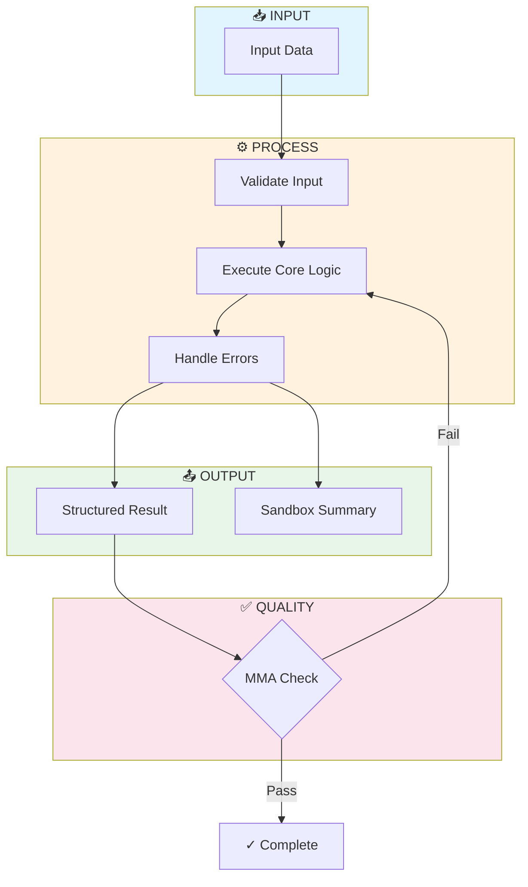

# ATOMIC KNOWLEDGE SYNTHESIS PIPELINE v2.0
## Modular Extraction Architecture for LCP Skill Bundles

**Pipeline:** Skill Atoms (Layer 1) → NotebookLM Router (Layer 2) → Claude Synthesizer (Layer 3)

**Doctrine:** Knowledge → Intelligence → Autonomy  
**Standard:** Lean Context Protocol (LCP)  
**Updated:** 2026-01-30

---

## CRITICAL CORRECTION

**This replaces the earlier "Knowledge Refinery Pipeline v1.0" that incorrectly included OpenAI Prism.**

Prism is LaTeX-centric (designed for scientific papers) and introduces friction into skill synthesis workflows. This **Atomic Retrieval** approach is native to ULTRAMIND architecture and prevents NotebookLM "tool tax."

### The Key Shift

```
WRONG (v1.0):  NotebookLM (Mega-Prompt) → Prism → Claude
RIGHT (v2.0):  Skill Atoms → NotebookLM (Router) → Claude (Synthesizer)
```

**Why this matters:**
- NotebookLM is a **Library**, not an agent
- Small atomic extractions prevent context rot
- Claude does the heavy synthesis work (where it excels)
- Modular atoms = reusable across multiple skills

---

## THE ATOMIC RETRIEVAL ARCHITECTURE

```
┌─────────────────────────────────────────────────────────────────────────────────┐
│                     ATOMIC KNOWLEDGE SYNTHESIS PIPELINE v2.0                    │
├─────────────────────────────────────────────────────────────────────────────────┤
│                                                                                 │
│   RAW INPUT                                                                     │
│   ─────────                                                                     │
│   ┌─────────────────────────────────────────────────────────┐                  │
│   │  Videos  │  PDFs  │  Courses  │  Docs  │  Transcripts  │                  │
│   └─────────────────────────────────────────────────────────┘                  │
│                              │                                                  │
│                              ▼                                                  │
│   ════════════════════════════════════════════════════════════════════════     │
│                                                                                 │
│   LAYER 1: ATOMIC EXTRACTION (Synthesizer 1)                                   │
│   ──────────────────────────────────────────                                   │
│   ┌─────────────────────────────────────────────────────────┐                  │
│   │  Extract small, schema-consistent "Skill Atoms"         │                  │
│   │  (1-3 pages each, API-endpoint naming)                  │                  │
│   │                                                          │                  │
│   │  Output Examples:                                        │                  │
│   │  • heuristic.10_to_1_rule.v1                            │                  │
│   │  • spec.playwright_wrapper.v1                           │                  │
│   │  • failure.context_rot.v1                               │                  │
│   │  • framework.lcp_architecture.v1                        │                  │
│   └─────────────────────────────────────────────────────────┘                  │
│                              │                                                  │
│                              ▼                                                  │
│   ════════════════════════════════════════════════════════════════════════     │
│                                                                                 │
│   LAYER 2: NOTEBOOKLM ROUTER (Library + Query Engine)                          │
│   ────────────────────────────────────────────────────                         │
│   ┌─────────────────────────────────────────────────────────┐                  │
│   │  Upload Skill Atoms as sources                          │                  │
│   │  Use NotebookLM to:                                     │                  │
│   │                                                          │                  │
│   │  • QUERY ROUTE: "Find all atoms about context rot"      │                  │
│   │  • CROSS-LINK: "Compare self-healing vs self-annealing" │                  │
│   │  • CLUSTER: "Group atoms for Module 3 Translator"       │                  │
│   │  • CONTRADICT: "Where do sources disagree?"             │                  │
│   └─────────────────────────────────────────────────────────┘                  │
│                              │                                                  │
│                              ▼                                                  │
│   ════════════════════════════════════════════════════════════════════════     │
│                                                                                 │
│   LAYER 3: CLAUDE SYNTHESIZER (Compiler + Polisher)                            │
│   ─────────────────────────────────────────────────                            │
│   ┌─────────────────────────────────────────────────────────┐                  │
│   │  Take clustered atoms and compile into:                 │                  │
│   │                                                          │                  │
│   │  DOUBLE-II OUTPUT:                                      │                  │
│   │  • SKILL.md (Information layer)                         │                  │
│   │  • implementation.py (Implementation layer)             │                  │
│   │  • flowgram.mmd (Visual bridge)                         │                  │
│   │  • zero_point.json (Index)                              │                  │
│   │                                                          │                  │
│   │  PRODUCTION HARDENING:                                  │                  │
│   │  • Constitution v2.1 compliance                         │                  │
│   │  • Pydantic type safety                                 │                  │
│   │  • Self-annealing patterns                              │                  │
│   │  • Test generation                                      │                  │
│   └─────────────────────────────────────────────────────────┘                  │
│                              │                                                  │
│                              ▼                                                  │
│   ┌─────────────────────────────────────────────────────────┐                  │
│   │              PRODUCTION LCP SKILL BUNDLE                │                  │
│   └─────────────────────────────────────────────────────────┘                  │
│                                                                                 │
└─────────────────────────────────────────────────────────────────────────────────┘
```

---

## LAYER 1: THE SKILL ATOM SCHEMA (v1.0)

### What is a Skill Atom?

A Skill Atom is the **smallest unit of extractable knowledge** — a single, schema-consistent file (1-3 pages) that can be:
- Queried individually
- Combined with other atoms
- Reused across multiple skills

**Think of atoms as Lego bricks** that Synthesizer 2 (Claude) snaps together into final skills.

### Naming Convention (API Endpoint Style)

```
[category].[name].[version]

Categories:
  • heuristic   — Rules of thumb
  • spec        — Technical specifications
  • failure     — Failure modes & learned constraints
  • framework   — Conceptual architectures
  • pattern     — Reusable code patterns
  • checklist   — Validation criteria
  • workflow    — Process sequences
```

### Examples:

```
heuristic.10_to_1_rule.v1
spec.playwright_wrapper.v1
failure.context_rot_prevention.v1
framework.lcp_architecture.v1
pattern.retry_with_backoff.v1
checklist.mcp_to_skill_migration.v1
workflow.n8n_to_python_translation.v1
```

---

## THE SKILL ATOM TEMPLATE

Every extraction should follow this strict Markdown template:

```markdown
# ATOM: [category].[name].[version]
# Source Ref: [NotebookLM Citation or Video Timestamp]

## 1. THE CORE LOGIC (Intent)

- **Constraint:** [One-sentence rule]
- **Rationale:** [Why this exists]

## 2. THE TECHNICAL PATTERN (Mechanism)

- **Language/SDK:** [e.g., Python / Playwright SDK]
- **Code Snippet:**
```python
# Representative pattern extracted from source
def example_pattern():
    pass
```

## 3. FAILURE MODES (Learned Constraints)

- **Warning:** [What breaks this logic]
- **Fix:** [How to prevent/recover]

## 4. USAGE TRIGGER

- **Trigger:** [When to apply this atom]
- **Anti-Trigger:** [When NOT to use]

## 5. CROSS-REFERENCES

- **Related Atoms:** [List of connected atoms]
- **Parent Skill:** [Which skill this belongs to]

---
*Atom Version: v1 | Extracted: [Date] | Confidence: [High/Medium/Low]*
```

---

## ATOM CATEGORY DEFINITIONS

### 1. HEURISTIC ATOMS
**Purpose:** Rules of thumb that guide decisions

```markdown
# ATOM: heuristic.10_to_1_rule.v1
# Source Ref: Video 23 @ 14:32

## 1. THE CORE LOGIC (Intent)

- **Constraint:** Cluster 10 visual automation nodes into 1 Python function
- **Rationale:** Prevents visual technical debt; keeps logic readable

## 2. THE TECHNICAL PATTERN (Mechanism)

- **Language/SDK:** Python
- **Code Snippet:**
```python
# Instead of 10 n8n nodes for "fetch + validate + transform"
def fetch_validate_transform(url: str) -> ProcessedData:
    raw = fetch(url)
    validated = validate(raw)
    return transform(validated)
```

## 3. FAILURE MODES (Learned Constraints)

- **Warning:** Violating this creates "spaghetti flows" in n8n
- **Fix:** Count nodes; if > 10 for single purpose, consolidate

## 4. USAGE TRIGGER

- **Trigger:** When reviewing n8n JSON with > 10 connected nodes
- **Anti-Trigger:** Simple 2-3 node sequences are fine as-is

## 5. CROSS-REFERENCES

- **Related Atoms:** workflow.n8n_to_python_translation.v1
- **Parent Skill:** Module 3 — Workflow Translator

---
*Atom Version: v1 | Extracted: 2026-01-30 | Confidence: High*
```

### 2. SPEC ATOMS
**Purpose:** Technical specifications and patterns

```markdown
# ATOM: spec.playwright_wrapper.v1
# Source Ref: Video 31 @ 08:45

## 1. THE CORE LOGIC (Intent)

- **Constraint:** Wrap Playwright in idempotent, retry-enabled functions
- **Rationale:** Browser automation fails; wrappers enable self-healing

## 2. THE TECHNICAL PATTERN (Mechanism)

- **Language/SDK:** Python / Playwright
- **Code Snippet:**
```python
from playwright.sync_api import sync_playwright
from tenacity import retry, stop_after_attempt

@retry(stop=stop_after_attempt(3))
def safe_navigate(url: str) -> str:
    with sync_playwright() as p:
        browser = p.chromium.launch()
        page = browser.new_page()
        page.goto(url)
        content = page.content()
        browser.close()
        return content
```

## 3. FAILURE MODES (Learned Constraints)

- **Warning:** Raw Playwright without retry = brittle scripts
- **Fix:** Always wrap in @retry decorator

## 4. USAGE TRIGGER

- **Trigger:** Any browser automation in Module 4+
- **Anti-Trigger:** API-based data fetching (use requests instead)

## 5. CROSS-REFERENCES

- **Related Atoms:** pattern.retry_with_backoff.v1
- **Parent Skill:** Module 4 — Browser Automation

---
*Atom Version: v1 | Extracted: 2026-01-30 | Confidence: High*
```

### 3. FAILURE ATOMS
**Purpose:** Document what breaks and how to prevent

```markdown
# ATOM: failure.context_rot_prevention.v1
# Source Ref: Video 12 @ 22:15

## 1. THE CORE LOGIC (Intent)

- **Constraint:** Never return full data to agent context; return summaries only
- **Rationale:** Full payloads rot context window, degrading reasoning

## 2. THE TECHNICAL PATTERN (Mechanism)

- **Language/SDK:** Python
- **Code Snippet:**
```python
def sandbox_execute(input: dict) -> str:
    """Execute in sandbox, return summary only"""
    full_result = execute_workflow(input)
    
    # CRITICAL: Summarize, don't return full payload
    return f"Processed {len(full_result)} items. Status: Success."
```

## 3. FAILURE MODES (Learned Constraints)

- **Warning:** Returning 50KB JSON to agent = context rot
- **Fix:** Sandbox Filtering pattern; summaries only

## 4. USAGE TRIGGER

- **Trigger:** Any script that returns data to agent
- **Anti-Trigger:** Human-facing outputs (dashboards, reports)

## 5. CROSS-REFERENCES

- **Related Atoms:** heuristic.zero_point_context.v1
- **Parent Skill:** All modules (universal pattern)

---
*Atom Version: v1 | Extracted: 2026-01-30 | Confidence: High*
```

### 4. FRAMEWORK ATOMS
**Purpose:** Conceptual architectures and mental models

```markdown
# ATOM: framework.lcp_architecture.v1
# Source Ref: ULTRAMIND Lean Stack v2.0

## 1. THE CORE LOGIC (Intent)

- **Constraint:** Skills + Scripts > MCPs for 80% of automations
- **Rationale:** On-demand NPM/PIP scripts beat always-loaded schemas

## 2. THE TECHNICAL PATTERN (Mechanism)

- **Language/SDK:** Architecture Pattern
- **Code Snippet:**
```yaml
LCP_STACK:
  always_loaded:
    - zero_point.json (< 100 tokens)
    - routing_rules.yaml
    - skill_capability_index.yaml
  
  on_demand:
    - skills/ (loaded when triggered)
    - scripts/ (executed then unloaded)
  
  never_loaded:
    - full MCP schemas
    - heavy parameter definitions
```

## 3. FAILURE MODES (Learned Constraints)

- **Warning:** Always-loaded MCPs tax every request
- **Fix:** Use file-based skills with progressive disclosure

## 4. USAGE TRIGGER

- **Trigger:** Any new automation architecture decision
- **Anti-Trigger:** N/A — this is foundational

## 5. CROSS-REFERENCES

- **Related Atoms:** heuristic.80_percent_rule.v1
- **Parent Skill:** Master Automations Architect (Meta)

---
*Atom Version: v1 | Extracted: 2026-01-30 | Confidence: High*
```

---

## LAYER 2: NOTEBOOKLM ROUTER PROMPTS

### Router Prompt 1: Category Extraction

```markdown
# NOTEBOOKLM EXTRACTION: [Module Name]

## CONTEXT
I need to extract Skill Atoms for the LCP (Lean Context Protocol) library.
These atoms will be uploaded back to NotebookLM for routing and cross-linking.

## SOURCE BASE
[N] sources about [TOPIC]

## EXTRACTION TASK

For each relevant insight, generate a Skill Atom using this template:

### ATOM: [category].[name].v1

**Categories to extract:**
1. HEURISTICS — Rules of thumb (e.g., "10 nodes to 1 script")
2. SPECS — Technical patterns (CLI commands, SDK usage)
3. FAILURES — What breaks and why (learned constraints)
4. FRAMEWORKS — Conceptual architectures
5. PATTERNS — Reusable code snippets
6. CHECKLISTS — Validation criteria
7. WORKFLOWS — Process sequences

**For each atom include:**
- Core Logic (one-sentence constraint + rationale)
- Technical Pattern (code if applicable)
- Failure Modes (what breaks, how to fix)
- Usage Trigger (when to apply)

**Naming Convention:**
[category].[descriptive_name].v1

**Size Constraint:**
Each atom must be < 3 pages to prevent tool tax.

## OUTPUT FORMAT
Generate atoms as separate markdown blocks, each following the schema exactly.
```

### Router Prompt 2: Query Routing

```markdown
# NOTEBOOKLM QUERY: [Specific Topic]

## QUERY TYPE: [route | cross-link | cluster | contradict]

## QUERY
[Your specific question]

## EXAMPLES

### Route Query:
"Find all atoms related to context rot prevention"

### Cross-Link Query:
"Compare the Wolverine self-healing pattern against LCP self-annealing"

### Cluster Query:
"Group all atoms needed for Module 3: Workflow Translator"

### Contradiction Query:
"Where do sources disagree about MCP vs Skill approaches?"

## OUTPUT REQUEST
Return the atom references (by name) and relevant excerpts.
```

### Router Prompt 3: Module Clustering

```markdown
# NOTEBOOKLM CLUSTER: Module [N] — [Module Name]

## GOAL
Identify all atoms required to build this module's skill bundle.

## MODULE SCOPE
[Description of what this module does]

## ATOM CATEGORIES NEEDED
- [ ] Heuristics for [specific decisions]
- [ ] Specs for [technical implementations]
- [ ] Failures to prevent
- [ ] Patterns to reuse
- [ ] Checklists for validation

## OUTPUT
List atoms by category with brief relevance notes:

### Required Atoms:
1. heuristic.xxx.v1 — [why needed]
2. spec.xxx.v1 — [why needed]
...

### Optional Atoms:
1. pattern.xxx.v1 — [might help with...]
...

### Missing Atoms:
1. [Gap identified] — need to extract from [source]
...
```

---

## LAYER 3: CLAUDE SYNTHESIZER PROMPTS

### Synthesizer Prompt: Double-II Compilation

```markdown
# CLAUDE SYNTHESIS: Module [N] — [Module Name]

## ROLE
You are the LCP Skill Compiler. Your job is to take clustered Skill Atoms 
and compile them into a production-ready Double-II skill bundle.

## INPUT: SKILL ATOMS
[Paste the clustered atoms from NotebookLM here]

## OUTPUT: DOUBLE-II BUNDLE

Generate these 4 files:

### 1. SKILL.md (Information Layer)

```markdown
# [MODULE NAME] v1.0.0
## [Subtitle]

**Skill ID:** [maa_module_N_v1.0.0]
**Domain:** tools
**Parent:** Master Automations Architect

---

## ZERO-POINT SCHEMA (~100 tokens)
{
  "skill": "[id]",
  "desc": "[one line]",
  "triggers": ["keyword1", "keyword2"],
  "outputs": ["SSOT_TYPE_1", "SSOT_TYPE_2"]
}

## CORE THESIS
[Synthesized from framework atoms — 2-3 paragraphs]

## WHEN TO USE
[From usage triggers across atoms]

## WHEN NOT TO USE
[From anti-triggers across atoms]

## EXECUTION PATTERN
[Synthesized from workflow atoms]

### Inputs Required
- [From spec atoms]

### Process Steps
1. [From workflow atoms]
2. ...

### Outputs Produced
- [SSOT types]

## LEARNED CONSTRAINTS
[Direct copy from failure atoms]

## INTEGRATION POINTS
- Upstream: [skills that feed into this]
- Downstream: [skills that consume outputs]

## EXAMPLES
[Generate from pattern atoms]
```

### 2. implementation.py (Implementation Layer)

```python
"""
[Module Name] - [Description]
Skill ID: [id]
Version: 1.0.0
"""

from pydantic import BaseModel, Field
from tenacity import retry, stop_after_attempt, wait_exponential
from typing import List, Optional
import logging

# Configure logging
logging.basicConfig(level=logging.INFO)
logger = logging.getLogger(__name__)

# ============================================================
# PYDANTIC MODELS (from spec atoms)
# ============================================================

class ModuleInput(BaseModel):
    """Input schema for [module]"""
    # [Fields from spec atoms]
    pass

class ModuleOutput(BaseModel):
    """Output schema for [module]"""
    # [Fields from spec atoms]
    pass

# ============================================================
# CORE FUNCTIONS (from pattern atoms)
# ============================================================

@retry(
    stop=stop_after_attempt(3),
    wait=wait_exponential(multiplier=1, min=2, max=10)
)
def execute(input: ModuleInput) -> ModuleOutput:
    """
    Main execution function.
    [Docstring from workflow atoms]
    """
    logger.info(f"Executing [module] with input: {input}")
    
    try:
        # [Implementation from pattern atoms]
        result = process(input)
        return ModuleOutput(**result)
    
    except Exception as e:
        logger.error(f"Execution failed: {e}")
        log_learned_constraint(str(e))
        raise

def sandbox_execute(input: dict) -> str:
    """
    Sandbox mode - returns summary only to prevent context rot.
    [From failure.context_rot_prevention.v1]
    """
    result = execute(ModuleInput(**input))
    return f"Processed successfully. Output type: {type(result).__name__}"

# ============================================================
# LEARNED CONSTRAINTS (from failure atoms)
# ============================================================

def log_learned_constraint(error: str):
    """Log failures for future constraint learning"""
    with open("learned_constraints.log", "a") as f:
        f.write(f"{datetime.now().isoformat()} | {error}\n")

# ============================================================
# CLI INTERFACE
# ============================================================

if __name__ == "__main__":
    import argparse
    import json
    
    parser = argparse.ArgumentParser(description="[Module Name]")
    parser.add_argument("--input", required=True, help="Input JSON file")
    parser.add_argument("--output", default="output.json", help="Output file")
    parser.add_argument("--sandbox", action="store_true", help="Run in sandbox mode")
    
    args = parser.parse_args()
    
    with open(args.input) as f:
        input_data = json.load(f)
    
    if args.sandbox:
        result = sandbox_execute(input_data)
        print(result)
    else:
        result = execute(ModuleInput(**input_data))
        with open(args.output, "w") as f:
            json.dump(result.model_dump(), f, indent=2)
        print(f"Output written to {args.output}")
```

### 3. flowgram.mmd (Visual Bridge)



### 4. zero_point.json (Index)

```json
{
  "skill": "[maa_module_N]",
  "version": "1.0.0",
  "desc": "[One-line description]",
  "domain": "tools",
  "parent": "master_automations_architect",
  "triggers": [
    "[keyword1]",
    "[keyword2]"
  ],
  "anti_triggers": [
    "[anti-keyword1]"
  ],
  "inputs": [
    "[INPUT_TYPE_1]",
    "[INPUT_TYPE_2]"
  ],
  "outputs": [
    "[OUTPUT_TYPE_1]",
    "[OUTPUT_TYPE_2]"
  ],
  "dependencies": {
    "upstream": ["[skill_id]"],
    "downstream": ["[skill_id]"],
    "tools": ["[tool_name]"]
  },
  "token_budget": {
    "L1": 500,
    "L2": 1500,
    "L3": 3000,
    "L4": 6000
  },
  "cli": "python implementation.py --input data.json",
  "mma_criteria": {
    "clarity": "[What makes output clear]",
    "completeness": "[Required elements]",
    "correctness": "[Validation rules]"
  }
}
```

## ARCHITECTURAL RULES TO APPLY

1. **80% Rule** — Skills over MCPs
2. **10-to-1 Rule** — Cluster nodes into functions
3. **Sandbox Filtering** — Return summaries only
4. **Self-Annealing** — @retry decorators required
5. **Progressive Disclosure** — Token budgets per layer
```

---

## ACTION BOARD (KANBAN)

| **NOW** | **NEXT** | **LATER** |
|---------|----------|-----------|
| **Ingest:** Upload source materials to NotebookLM | **Extract:** Run Atom extraction prompts | **Compile:** Feed atoms to Claude Synthesizer |
| **Schema:** Create atom folder structure | **Tag:** Apply naming convention | **Test:** Validate compiled skill |
| **Query:** Identify key topics for atoms | **Link:** Cross-reference related atoms | **Deploy:** Add to skill manifest |

---

## ARTIFACT INDEX (SSOT)

```
/library/
├── atoms/
│   ├── heuristics/
│   │   ├── heuristic.10_to_1_rule.v1.md
│   │   ├── heuristic.80_percent_rule.v1.md
│   │   └── heuristic.zero_point_context.v1.md
│   │
│   ├── specs/
│   │   ├── spec.playwright_wrapper.v1.md
│   │   ├── spec.cli_execution.v1.md
│   │   └── spec.pydantic_models.v1.md
│   │
│   ├── failures/
│   │   ├── failure.context_rot_prevention.v1.md
│   │   ├── failure.mcp_overload.v1.md
│   │   └── failure.n8n_scaling.v1.md
│   │
│   ├── frameworks/
│   │   ├── framework.lcp_architecture.v1.md
│   │   └── framework.double_ii.v1.md
│   │
│   ├── patterns/
│   │   ├── pattern.retry_with_backoff.v1.md
│   │   └── pattern.sandbox_execution.v1.md
│   │
│   ├── checklists/
│   │   └── checklist.mcp_to_skill_migration.v1.md
│   │
│   └── workflows/
│       └── workflow.n8n_to_python_translation.v1.md
│
├── compendium/
│   └── lcp_patterns_v1.0.0.md (versioned collection)
│
└── output/
    └── claude_skills/
        ├── module_3_workflow_translator/
        │   ├── SKILL.md
        │   ├── implementation.py
        │   ├── flowgram.mmd
        │   └── zero_point.json
        └── ...
```

---

## QUICK REFERENCE: 5-STEP WORKFLOW

```
STEP 1: EXTRACT ATOMS
────────────────────
• Use NotebookLM Extraction Prompt
• Generate 1-3 page atoms per insight
• Name as [category].[name].v1

STEP 2: UPLOAD TO NOTEBOOKLM
────────────────────────────
• Add atoms as sources
• Create module-specific notebooks

STEP 3: QUERY & CLUSTER
───────────────────────
• Use Router Prompts to find patterns
• Cluster atoms by module
• Identify gaps

STEP 4: SYNTHESIZE IN CLAUDE
────────────────────────────
• Use Synthesizer Prompt
• Input: clustered atoms
• Output: Double-II skill bundle

STEP 5: VALIDATE & DEPLOY
─────────────────────────
• Run Constitution v2.1 check
• Test CLI interface
• Add to skill manifest
```

---

## PIPELINE ECONOMICS

| Stage | Tool | Cost | Time per Module |
|-------|------|------|-----------------|
| Layer 1 | NotebookLM + Manual | Free | 2-3 hours |
| Layer 2 | NotebookLM | Free | 1-2 hours |
| Layer 3 | Claude Opus 4.5 | Subscription | 1-2 hours |
| **Total** | | **Sub only** | **4-7 hours** |

---

## KEY DIFFERENCES FROM v1.0

| Aspect | v1.0 (Wrong) | v2.0 (Correct) |
|--------|--------------|----------------|
| **Stage 2 Tool** | OpenAI Prism | NotebookLM Router |
| **NotebookLM Role** | Mega-synthesizer | Library + Query Engine |
| **Extraction Size** | Large reports | Small atoms (1-3 pages) |
| **Reusability** | One-shot extraction | Atoms reusable across skills |
| **Tool Tax** | High (overloads NLM) | Low (atomic queries) |

---

*Atomic Knowledge Synthesis Pipeline v2.0*  
*Skill Atoms → NotebookLM Router → Claude Synthesizer*  
*"Lego bricks, not monoliths"*
