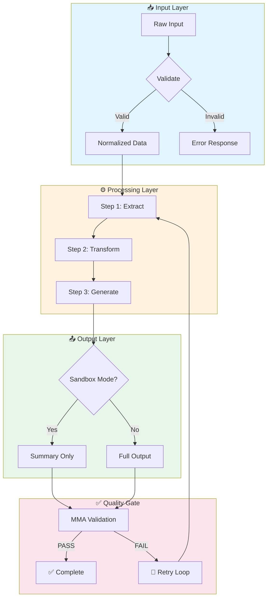

# KNOWLEDGE REFINERY PIPELINE v1.0
## Double-Synthesizer Architecture for LCP Skill Bundles

**Pipeline:** NotebookLM (Extraction) → OpenAI Prism (Synthesis) → Claude Opus 4.5 (Polish)

**Doctrine:** Knowledge → Intelligence → Autonomy  
**Standard:** Lean Context Protocol (LCP)  
**Updated:** 2026-01-30

---

## EXECUTIVE SUMMARY

This pipeline transforms raw knowledge (videos, docs, masterclasses) into production-ready LCP Skill Bundles using a 3-stage refinery model:

| Stage | Tool | Purpose | Output |
|-------|------|---------|--------|
| **Stage 1** | NotebookLM | Extraction & Theming | Raw themes, relationships, contradictions |
| **Stage 2** | OpenAI Prism | Architectural Synthesis | Structured skill bundles, scripts, schemas |
| **Stage 3** | Claude Opus 4.5 | Precision Polish | Production-ready XML, validated code, SSOT alignment |

**Key Insight:** NotebookLM hits limits at ~50 sources because it optimizes for citation accuracy over volume. Prism's GPT-5.2 handles unlimited projects with LaTeX/Markdown focus — ideal for architectural builds.

---

## THE DOUBLE-SYNTHESIZER ARCHITECTURE

```
┌─────────────────────────────────────────────────────────────────────────────┐
│                        KNOWLEDGE REFINERY PIPELINE                          │
├─────────────────────────────────────────────────────────────────────────────┤
│                                                                             │
│   RAW INPUT                  STAGE 1                    STAGE 2             │
│   ─────────                  ───────                    ───────             │
│   ┌─────────┐               ┌─────────────┐           ┌─────────────┐      │
│   │ Videos  │──────────────▶│ NotebookLM  │──────────▶│ OpenAI      │      │
│   │ PDFs    │   Batches     │ (Extractor) │  Themes   │ Prism       │      │
│   │ Docs    │   20-30/run   │             │  + Notes  │ (Architect) │      │
│   │ Courses │               └─────────────┘           └──────┬──────┘      │
│   └─────────┘                                                │             │
│                                                              │             │
│                              STAGE 3                         │             │
│                              ───────                         ▼             │
│                            ┌─────────────┐           ┌─────────────┐      │
│                            │ Claude      │◀──────────│ LCP Skill   │      │
│                            │ Opus 4.5    │  Draft    │ Bundles     │      │
│                            │ (Polisher)  │  Bundles  │ (Draft)     │      │
│                            └──────┬──────┘           └─────────────┘      │
│                                   │                                        │
│                                   ▼                                        │
│                            ┌─────────────┐                                │
│                            │ Production  │                                │
│                            │ LCP Skills  │                                │
│                            │ + Scripts   │                                │
│                            └─────────────┘                                │
│                                                                             │
└─────────────────────────────────────────────────────────────────────────────┘
```

---

## STAGE 1: NOTEBOOKLM EXTRACTION

### Purpose
Extract raw themes, relationships, and key insights from source materials. NotebookLM excels at citation-accurate extraction over small clusters.

### Batch Strategy
- **Batch Size:** 20-30 sources per notebook
- **Why:** NotebookLM optimizes for high-accuracy citation, not volume
- **Workaround:** Create multiple notebooks, one per knowledge cluster

### NotebookLM Master Prompt Template

```markdown
# EXTRACTION PROMPT: [Module Name]

## CONTEXT
I am building an LCP (Lean Context Protocol) skill bundle for ULTRAMIND.
This notebook contains [N] sources about [TOPIC].

## EXTRACTION OBJECTIVES

### 1. CORE THEMES
Identify the 5-10 most important themes across all sources:
- What concepts appear repeatedly?
- What frameworks are referenced?
- What principles emerge?

### 2. KNOWLEDGE HIERARCHY
Extract the information architecture:
- What are the foundational concepts (must understand first)?
- What are the intermediate concepts (build on foundations)?
- What are the advanced concepts (require full context)?

### 3. CONTRADICTIONS & TENSIONS
Where do sources disagree or present alternative views?
- Source A says X, Source B says Y
- Resolution: [how to synthesize]

### 4. ACTIONABLE PATTERNS
What specific, repeatable patterns can be extracted?
- Frameworks (X → Y → Z sequences)
- Decision trees (if A, then B)
- Checklists (always do 1, 2, 3)

### 5. ZERO-POINT CANDIDATES
What information is so foundational it must always be loaded?
- Core definitions (< 100 tokens)
- Key relationships (< 50 tokens)
- Essential constraints (< 50 tokens)

### 6. IMPLEMENTATION HINTS
What clues exist for turning this into executable code?
- APIs mentioned
- Tools referenced
- Code patterns suggested

## OUTPUT FORMAT

### THEME MAP
```yaml
themes:
  - name: [Theme Name]
    importance: [1-10]
    sources: [list of source IDs]
    summary: [1-2 sentences]
    related_themes: [list]
```

### HIERARCHY MAP
```yaml
hierarchy:
  foundational:
    - concept: [Name]
      definition: [Brief]
      dependencies: []
  intermediate:
    - concept: [Name]
      definition: [Brief]
      dependencies: [foundational concepts]
  advanced:
    - concept: [Name]
      definition: [Brief]
      dependencies: [intermediate concepts]
```

### CONTRADICTION LOG
```yaml
contradictions:
  - tension: [Description]
    source_a: [ID + position]
    source_b: [ID + position]
    resolution: [How to synthesize]
```

### PATTERN LIBRARY
```yaml
patterns:
  - name: [Pattern Name]
    type: [framework | decision_tree | checklist | workflow]
    steps: [list]
    when_to_use: [context]
    sources: [list]
```

### ZERO-POINT SCHEMA
```yaml
zero_point:
  definitions:
    - term: [Name]
      def: [< 20 words]
  relationships:
    - [A] → [B]: [nature of relationship]
  constraints:
    - [Must always / Must never]
```
```

### NotebookLM Audio/Video Overview Prompts

For **Audio Overview** generation:
```
Create a podcast-style discussion that:
1. Explains the core thesis in the first 2 minutes
2. Walks through the main themes conversationally
3. Highlights surprising contradictions or insights
4. Ends with "if you remember one thing" takeaway
```

For **Video Overview** (if available):
```
Create a visual summary that:
1. Maps the knowledge hierarchy as a diagram
2. Shows relationships between themes
3. Highlights the "Zero-Point" essentials
4. Indicates implementation pathways
```

---

## STAGE 2: OPENAI PRISM SYNTHESIS

### Purpose
Transform NotebookLM extractions into structured LCP Skill Bundles. Prism's GPT-5.2 maintains architectural coherence across long documents.

### Prism Master Prompt

```markdown
# PRISM SYNTHESIS PROMPT: LCP Skill Architecture

## ROLE
ACT AS: Lead Agentic Architect (LCP Specialist)
EXPERTISE: Lean Context Protocol, ULTRAMIND Skills, Zero-Point Architecture

## CONTEXT
I am migrating knowledge extractions into production-ready LCP Skill Bundles.
Architecture: "Skills + Scripts > MCPs"
Doctrine: Token discipline = Accuracy discipline

## INPUT
[PASTE NOTEBOOKLM EXTRACTION OUTPUT HERE]

## SYNTHESIS OBJECTIVES

### 1. SKILL STRUCTURE
Create a complete skill folder structure:

```
/skills/[skill_name]/
├── SKILL.md          # The Brain (SOP + Zero-Point Schema)
├── implementation.py # The Body (Deterministic Python)
├── flowgram.mmd      # The Bridge (Mermaid visualization)
├── zero_point.json   # The Index (minimal descriptor)
├── tests/
│   ├── test_implementation.py
│   └── fixtures/
└── docs/
    ├── learned_constraints.md
    └── examples/
```

### 2. SKILL.MD TEMPLATE (The Brain)
Generate using this structure:

```markdown
# [SKILL NAME] v[VERSION]
## [Subtitle describing core capability]

**Purpose:** [One sentence]
**Domain:** [meta | copy | product | research | design | tools]
**Token Budget:** [L1: ~500 | L2: ~1500 | L3: ~3000 | L4: ~6000]

---

## ZERO-POINT SCHEMA (~100 tokens)

```json
{
  "skill": "[skill_id]",
  "desc": "[< 20 word description]",
  "triggers": ["keyword1", "keyword2"],
  "outputs": ["output_type_1", "output_type_2"]
}
```

---

## CORE THESIS

[2-3 paragraphs explaining the fundamental insight this skill embeds]

---

## WHEN TO USE

### Trigger Conditions
- [Condition 1]
- [Condition 2]

### NOT For
- [Anti-pattern 1]
- [Anti-pattern 2]

---

## EXECUTION PATTERN

### Input Requirements
```yaml
required:
  - [input_1]: [type]
  - [input_2]: [type]
optional:
  - [input_3]: [type]
```

### Process Flow
1. [Step 1]
2. [Step 2]
3. [Step 3]

### Output Specification
```yaml
outputs:
  primary: [description]
  secondary: [description]
  artifacts: [list of files created]
```

---

## LEARNED CONSTRAINTS

> These constraints were discovered through execution failures and self-annealing.

1. **[Constraint Name]:** [Description]
   - *Discovered:* [Date]
   - *Failure Mode:* [What broke]
   - *Resolution:* [How to avoid]

---

## INTEGRATION POINTS

| Upstream | Downstream |
|----------|------------|
| [ZPWO phase] | [MMA validation] |
| [SSOT input] | [SSOT output] |

---

## VERSION HISTORY

| Version | Date | Changes |
|---------|------|---------|
| 1.0.0 | [Date] | Initial release |
```

### 3. IMPLEMENTATION.PY TEMPLATE (The Body)

```python
"""
[SKILL_NAME] Implementation
Version: [VERSION]
Purpose: [Brief description]

Architecture: LCP Standard
Doctrine: Skills + Scripts > MCPs
"""

import json
from pathlib import Path
from typing import Any, Dict, List, Optional
from pydantic import BaseModel, Field
from tenacity import retry, stop_after_attempt, wait_exponential

# ============================================================
# MODELS (Pydantic for type safety)
# ============================================================

class SkillInput(BaseModel):
    """Input schema for skill execution"""
    # Define required inputs
    pass

class SkillOutput(BaseModel):
    """Output schema for skill execution"""
    # Define expected outputs
    pass

class LearnedConstraint(BaseModel):
    """Constraint discovered through execution"""
    name: str
    description: str
    failure_mode: str
    resolution: str
    discovered_at: str

# ============================================================
# CORE IMPLEMENTATION
# ============================================================

@retry(
    stop=stop_after_attempt(3),
    wait=wait_exponential(multiplier=1, min=4, max=10)
)
def execute_skill(input_data: SkillInput) -> SkillOutput:
    """
    Main execution function with self-annealing retry logic.
    
    The @retry decorator implements self-healing:
    - 3 attempts max
    - Exponential backoff between attempts
    - Prevents infinite loops
    """
    try:
        # Step 1: Validate input
        validated = validate_input(input_data)
        
        # Step 2: Core logic
        result = process_core_logic(validated)
        
        # Step 3: Format output
        output = format_output(result)
        
        return output
        
    except Exception as e:
        # Log for learned constraints
        log_failure(e, input_data)
        raise

def validate_input(data: SkillInput) -> Dict[str, Any]:
    """Validate and normalize input data"""
    # Validation logic
    pass

def process_core_logic(data: Dict[str, Any]) -> Dict[str, Any]:
    """Core business logic - deterministic operations"""
    # Implementation
    pass

def format_output(result: Dict[str, Any]) -> SkillOutput:
    """Format result into standard output schema"""
    # Formatting logic
    pass

def log_failure(error: Exception, context: Any) -> None:
    """Log failures for learned constraints analysis"""
    constraint_log = Path("docs/learned_constraints.md")
    # Append failure info for later analysis
    pass

# ============================================================
# SANDBOX FILTERING (Context Rot Prevention)
# ============================================================

def sandbox_execute(input_data: SkillInput) -> str:
    """
    Execute in sandbox mode - returns summary only.
    
    This prevents Context Rot by:
    1. Running full logic in isolation
    2. Returning only summary/reference IDs
    3. Keeping main context window pristine
    """
    full_result = execute_skill(input_data)
    
    # Return compressed summary
    return json.dumps({
        "status": "success",
        "summary": full_result.summary[:200],
        "reference_id": full_result.id,
        "artifacts_created": [a.name for a in full_result.artifacts]
    })

# ============================================================
# CLI INTERFACE
# ============================================================

if __name__ == "__main__":
    import sys
    import argparse
    
    parser = argparse.ArgumentParser(description="[SKILL_NAME] CLI")
    parser.add_argument("--input", type=str, help="Input JSON file")
    parser.add_argument("--sandbox", action="store_true", help="Run in sandbox mode")
    
    args = parser.parse_args()
    
    if args.input:
        with open(args.input) as f:
            input_data = SkillInput(**json.load(f))
        
        if args.sandbox:
            result = sandbox_execute(input_data)
        else:
            result = execute_skill(input_data)
        
        print(json.dumps(result.dict() if hasattr(result, 'dict') else result))
```

### 4. FLOWGRAM.MMD TEMPLATE (The Bridge)



### 5. ZERO_POINT.JSON TEMPLATE

```json
{
  "skill_id": "skill.[domain].[name].v[version]",
  "name": "[Human-readable name]",
  "version": "[semver]",
  "description": "[< 30 words describing capability]",
  
  "triggers": [
    "keyword_1",
    "keyword_2",
    "keyword_3"
  ],
  
  "domain": "[meta|copy|product|research|design|tools]",
  
  "inputs": {
    "required": ["input_1", "input_2"],
    "optional": ["input_3"]
  },
  
  "outputs": ["output_type_1", "output_type_2"],
  
  "dependencies": {
    "upstream": ["skill_id_1"],
    "downstream": ["skill_id_2"]
  },
  
  "token_budget": {
    "L1_quick_ref": 500,
    "L2_standard": 1500,
    "L3_detailed": 3000,
    "L4_complete": 6000
  },
  
  "cli_command": "uv run skills/[name]/implementation.py",
  
  "last_updated": "[ISO date]"
}
```

## ARCHITECTURAL RULES FOR PRISM

Apply these constraints during synthesis:

### The 80% Rule
> Replace MCP tool-calling with file-system-based Skills for 80% of operations.

### The 10-to-1 Rule
> Cluster 10 visual nodes (n8n/Make) into 1 Python function.

### Sandbox Filtering
> Scripts must return only summaries or reference IDs to keep the main context window pristine.

### Package-First Strategy
> Use official SDKs (requests, anthropic, openai) over custom implementations.

### Self-Annealing Required
> Every script must include @retry decorators with exponential backoff.

---

## STAGE 3: CLAUDE OPUS 4.5 POLISH

### Purpose
Final precision polish: XML validation, SSOT alignment, Constitution compliance, production hardening.

### Claude Opus 4.5 Polish Prompt

```markdown
# FINAL POLISH: LCP Skill Production

## ROLE
ACT AS: ULTRAMIND Quality Engineer
STANDARD: ULTRAMIND Constitution v2.1 + Lean Stack v2.0

## INPUT
[PASTE PRISM OUTPUT HERE - SKILL.md, implementation.py, flowgram.mmd, zero_point.json]

## POLISH OBJECTIVES

### 1. CONSTITUTION COMPLIANCE CHECK
Verify against ULTRAMIND Constitution v2.1:
- [ ] Token discipline enforced
- [ ] Skills > MCPs doctrine followed
- [ ] Zero-Point Context Strategy respected
- [ ] Self-annealing patterns implemented
- [ ] SSOT integration defined

### 2. LEAN STACK ALIGNMENT
Verify against Lean Stack v2.0:
- [ ] Correct domain classification
- [ ] Proper layer placement (L1-L4)
- [ ] Tool index integration
- [ ] Knowledge graph compatibility

### 3. CODE QUALITY
For implementation.py:
- [ ] Type hints complete (Pydantic models)
- [ ] Error handling comprehensive
- [ ] Logging implemented
- [ ] Tests exist
- [ ] CLI interface functional

### 4. XML SKILL CONVERSION (if needed)
Convert to ULTRAMIND XML Skill format:

```xml
<?xml version="1.0" encoding="UTF-8"?>
<Skill
  skill_id="skill.[domain].[name].v[version]"
  name="[Name]"
  version="[semver]"
  tier="[production|draft]"
  status="[active|deprecated]"
  model="[sonnet|opus]"
>
  <Meta>
    <n>[Full Name]</n>
    <Subtitle>[Tagline]</Subtitle>
    <Description>[Detailed description]</Description>
    <!-- Additional metadata -->
  </Meta>
  
  <Scope>
    <WhenToUse>
      <Trigger>[Condition 1]</Trigger>
      <Trigger>[Condition 2]</Trigger>
    </WhenToUse>
    <NotFor>
      <Item>[Anti-pattern 1]</Item>
    </NotFor>
  </Scope>
  
  <SSOT>
    <Required>
      <Input name="[NAME]">[Description]</Input>
    </Required>
    <Outputs>
      <Output id="[ID]" format="[format]">[Description]</Output>
    </Outputs>
  </SSOT>
  
  <ProgressiveDisclosure>
    <Layer id="L1" name="Quick Reference" token_budget="500">
      <!-- Always-loaded essentials -->
    </Layer>
    <Layer id="L2" name="Standard" token_budget="1500">
      <!-- Standard execution context -->
    </Layer>
    <Layer id="L3" name="Detailed" token_budget="3000">
      <!-- Full patterns and examples -->
    </Layer>
    <Layer id="L4" name="Complete" token_budget="6000">
      <!-- Complete reference including edge cases -->
    </Layer>
  </ProgressiveDisclosure>
  
  <Execution>
    <!-- Execution patterns -->
  </Execution>
  
  <LearnedConstraints>
    <Constraint id="LC-01">
      <Description>[What we learned]</Description>
      <FailureMode>[What broke]</FailureMode>
      <Resolution>[How to avoid]</Resolution>
    </Constraint>
  </LearnedConstraints>
</Skill>
```

### 5. FINAL CHECKLIST

```yaml
production_readiness:
  documentation:
    - [ ] SKILL.md complete
    - [ ] Zero-Point schema accurate
    - [ ] Flowgram renders correctly
    - [ ] Examples provided
  
  code:
    - [ ] Implementation runs without errors
    - [ ] Tests pass
    - [ ] CLI interface works
    - [ ] Sandbox mode functional
  
  integration:
    - [ ] ZPWO routing defined
    - [ ] MMA validation criteria set
    - [ ] SSOT inputs/outputs specified
    - [ ] Dependencies declared
  
  compliance:
    - [ ] Constitution v2.1 ✓
    - [ ] Lean Stack v2.0 ✓
    - [ ] Token budgets enforced ✓
```

## OUTPUT
Deliver:
1. Polished SKILL.md
2. Production implementation.py
3. Clean flowgram.mmd
4. Validated zero_point.json
5. XML skill file (if requested)
6. Test suite
7. Production readiness report
```

---

## SUB-MODULE GRANULARIZATION GUIDE

For complex skills with 8+ modules (like Lean Context Automations), granularize into sub-module components:

### Structure Pattern

```
/skills/lean_context_automations/
├── SKILL.md                    # Master skill overview
├── zero_point.json             # Master index
│
├── modules/
│   ├── 01_workflow_analyzer/
│   │   ├── SKILL.md
│   │   ├── implementation.py
│   │   └── zero_point.json
│   │
│   ├── 02_intent_extractor/
│   │   ├── SKILL.md
│   │   ├── implementation.py
│   │   └── zero_point.json
│   │
│   ├── 03_workflow_translator/  # (Module 3 - completed)
│   │   ├── SKILL.md
│   │   ├── implementation.py
│   │   └── zero_point.json
│   │
│   ├── 04_browser_automation/   # (Module 4 - in progress)
│   │   ├── SKILL.md
│   │   ├── implementation.py
│   │   └── zero_point.json
│   │
│   └── [05-08]_remaining_modules/
│
├── orchestrator.py             # Module coordination
└── tests/
```

### Module Index Template

```json
{
  "skill_id": "skill.tools.lean_context_automations.v1_0_0",
  "name": "Lean Context Automations",
  "module_count": 8,
  
  "modules": [
    {
      "id": "M01",
      "name": "Workflow Analyzer",
      "purpose": "Parse and analyze visual workflow JSON",
      "status": "production",
      "path": "modules/01_workflow_analyzer/"
    },
    {
      "id": "M02",
      "name": "Intent Extractor",
      "purpose": "Extract business intent from workflow structure",
      "status": "production",
      "path": "modules/02_intent_extractor/"
    },
    {
      "id": "M03",
      "name": "Workflow Translator",
      "purpose": "Convert visual workflows to LCP bundles",
      "status": "production",
      "path": "modules/03_workflow_translator/"
    },
    {
      "id": "M04",
      "name": "Browser Automation",
      "purpose": "Execute browser tasks via Vercel agent-browser",
      "status": "building",
      "path": "modules/04_browser_automation/"
    }
  ],
  
  "orchestration": {
    "default_flow": ["M01", "M02", "M03"],
    "browser_flow": ["M01", "M02", "M04"],
    "full_flow": ["M01", "M02", "M03", "M04"]
  }
}
```

---

## WORKFLOW BRIEF v1.0

### Goal
Build a 100-video synthesized Skill Library for Claude/Antigravity using the Knowledge Refinery Pipeline.

### The Stack
| Stage | Tool | Cost | Role |
|-------|------|------|------|
| Extraction | NotebookLM | Free | Ore processor |
| Synthesis | OpenAI Prism | Free (personal tier) | Smelter |
| Polish | Claude Opus 4.5 | Subscription | Precision caster |

### Timeline Estimate
| Phase | Time | Output |
|-------|------|--------|
| NotebookLM batching (5 notebooks × 20 sources) | 2-3 hours | Raw extractions |
| Prism synthesis per module | 30-60 min each | Draft bundles |
| Claude polish per module | 20-30 min each | Production skills |
| **Total for 8-module skill** | ~8-12 hours | Complete LCP library |

---

## ACTION BOARD (Kanban)

### NOW
- [ ] Initialize first NotebookLM notebook with 20-30 sources
- [ ] Define extraction prompt for Module 3 sources
- [ ] Create Prism workspace at prism.openai.com

### NEXT
- [ ] Run NotebookLM extraction, export themes
- [ ] Paste to Prism, generate draft skill bundles
- [ ] Polish in Claude Opus 4.5, validate XML

### LATER
- [ ] Scale to remaining modules (4-8)
- [ ] Build orchestrator.py for module coordination
- [ ] Integrate with ULTRAMIND SKILLS_MANIFEST.yaml
- [ ] Deploy to Claude Code Desktop for testing

---

## APPENDIX: SELF-ANNEALING DOCTOR SCRIPT

For automated skill healing:

```python
"""
Self-Annealing Doctor
Analyzes skill execution failures and proposes fixes.
"""

import subprocess
from pathlib import Path
from tenacity import retry, stop_after_attempt, after_log
import logging
import json

logging.basicConfig(level=logging.INFO)
logger = logging.getLogger(__name__)

def ask_the_doctor(error_trace: str, script_content: str) -> str:
    """
    The 'Healer' Agent.
    Sends error + script to Claude for surgical fix.
    """
    from anthropic import Anthropic
    
    client = Anthropic()
    
    prompt = f"""You are a code doctor. A script failed with this error:

ERROR TRACE:
{error_trace}

ORIGINAL CODE:
{script_content}

Fix the code. Return ONLY the fixed code, no explanations.
Preserve all imports, type hints, and docstrings.
"""
    
    response = client.messages.create(
        model="claude-sonnet-4-20250514",
        max_tokens=4000,
        messages=[{"role": "user", "content": prompt}]
    )
    
    return response.content[0].text

def log_learned_constraint(script_path: Path, error: str, fix: str):
    """Log the failure for future learning."""
    constraint_log = script_path.parent / "docs" / "learned_constraints.md"
    constraint_log.parent.mkdir(exist_ok=True)
    
    entry = f"""
## Constraint Discovered: {error[:50]}...
- **Date:** {__import__('datetime').datetime.now().isoformat()}
- **Script:** {script_path.name}
- **Error:** `{error[:200]}`
- **Fix Applied:** Automated via Self-Annealing Doctor
"""
    
    with open(constraint_log, "a") as f:
        f.write(entry)

@retry(stop=stop_after_attempt(5))
def run_and_heal(script_path: str):
    """Execute script with self-healing."""
    path = Path(script_path)
    
    try:
        result = subprocess.run(
            ["python", str(path)],
            capture_output=True,
            text=True,
            check=True
        )
        print(f"✅ Execution Successful: {result.stdout[:200]}")
        return result.stdout
        
    except subprocess.CalledProcessError as e:
        logger.warning(f"❌ Crash detected. Trace: {e.stderr[:500]}")
        
        # Read current code
        with open(path, "r") as f:
            old_code = f.read()
        
        # Get fix from doctor
        fixed_code = ask_the_doctor(e.stderr, old_code)
        
        # Apply fix
        with open(path, "w") as f:
            f.write(fixed_code)
        
        # Log constraint
        log_learned_constraint(path, e.stderr, fixed_code)
        
        # Raise to trigger retry
        raise

if __name__ == "__main__":
    import sys
    if len(sys.argv) > 1:
        run_and_heal(sys.argv[1])
    else:
        print("Usage: python doctor.py <script_path>")
```

---

**Knowledge Refinery Pipeline v1.0**
**NotebookLM → Prism → Claude Opus 4.5**
**Raw Knowledge → Structured Intelligence → Production Autonomy**
