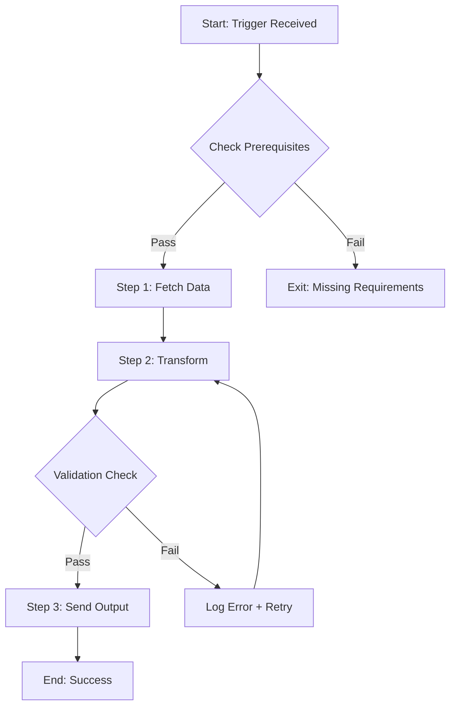

# MODULE ONE: MASTER AUTOMATIONS ARCHITECT
## The Doctrine Layer for Lean Automation Design

**Version:** 1.1.0  
**Module Type:** Doctrine (Strategy + Routing)  
**Token Budget:** ~4,500 tokens (L1: 650 | L2: 1,600 | L3: 1,400 | L4: 850)  
**Integration:** Hub connecting Modules 2-8  
**Build Date:** 2026-01-23  
**Upgraded:** 2026-01-23 (NotebookLM Patch Integration)  
**Doctrine:** Skills + Scripts > MCPs | Zero-Point Context Strategy | Package-First Architecture

---

## VERSION 1.1.0 CHANGELOG

| Patch ID | Type | Priority | Source |
|----------|------|----------|--------|
| S1_PAIN_6 | New Pain | High | Prompt Engineering - MCP Problems |
| S2_WORKFLOW_3.4 | New Step | Medium | Adam Goodyer - Visual Documentation |
| S3_HEURISTIC_12 | New Heuristic | Critical | IndyDevDan + Kevin Badi - Double-II |
| S3_TOOL_MATRIX | Refinement | High | Income Stream Surfers - NPM Agents |
| S3_ANTIPATTERN_8 | New Anti-Pattern | High | Kenny Liao - Discovery vs Lists |
| S5_PATTERN_11 | New Pattern | Critical | IndyDevDan - Expertise Files |
| S5_PATTERN_12 | New Pattern | Medium | Kevin Badi - Self-Annealing |
| CONFLICT_1 | Matrix Reorder | High | Tech Friend AJ - CLI First |

---

# TABLE OF CONTENTS

1. [GEO Knowledge Compendium](#section-1-geo-knowledge-compendium) (6 pages)
2. [Module Blueprint](#section-2-module-blueprint) (13-15 pages)
3. [Knowledge Blocks](#section-3-knowledge-blocks) (7-8 pages)
4. [Case Studies](#section-4-case-studies) (3-4 pages)
5. [Pattern Library](#section-5-pattern-library) (3 pages)
6. [Output Templates](#section-6-output-templates) (2 pages)
7. [README & Integration](#section-7-readme-integration) (1 page)

---

# SECTION 1: GEO KNOWLEDGE COMPENDIUM
## The Six Core Pains of Automation Architecture

*"Token discipline is accuracy discipline. Every always-loaded parameter schema competes with your offer, your copy voice, your SSOT objects, and your orchestration rules."*

---

## 1.1 THE AUTOMATION LANDSCAPE CRISIS

Before diving into solutions, we must understand why 80% of business automations fail to deliver promised value. The automation industry has created a false dichotomy: either use "no-code" visual tools (n8n, Zapier, Make) or hire developers for custom solutions. Both paths lead to the same six core pains.

### The False Promise of Visual Automation

Visual automation tools promised democratization. Instead, they created:
- **Dependency on platforms** that can change pricing, features, or shut down
- **Hidden complexity** that explodes when workflows exceed toy examples
- **Technical debt** disguised as "no-code simplicity"
- **Context bloat** when connecting these tools to AI agents

### The Hidden Cost of MCP Architecture

Model Context Protocol (MCP) promised seamless AI-tool integration. The reality:
- **Always-loaded schemas** consume 2,000-5,000 tokens per tool
- **Cognitive load** degrades model accuracy as tools accumulate
- **Vendor lock-in** to specific MCP implementations
- **Black box execution** with inconsistent error handling

---

## 1.2 THE SIX CORE PAINS

### PAIN #1: Visual Spaghetti Syndrome

**Symptoms:**
- Workflows with 20+ nodes that nobody can follow
- "Don't touch it, it works" warnings on production automations
- Hours spent debugging a single failed node
- Inability to parallelize or optimize execution paths
- Copy-paste duplication across similar workflows

**Root Causes:**
- Visual tools encourage adding nodes instead of refactoring
- No abstraction mechanisms (functions, modules, inheritance)
- Each node is a potential failure point with its own error handling
- Connection logic embedded in visual layout, not explicit code

**Evidence from Practice:**
| Metric | Visual Workflow | PCE Equivalent |
|--------|-----------------|----------------|
| Nodes/Steps | 28 nodes | 4 scripts |
| Debug time | 2-4 hours | 15-30 minutes |
| Modification time | 45-60 minutes | 10-15 minutes |
| Error handling | Per-node (28 places) | Centralized (1 place) |
| Parallelization | Manual rewiring | Automatic |

**Strategic Implications:**
- Every hour spent debugging visual spaghetti is an hour not spent on value creation
- Accumulated technical debt makes automation migration increasingly expensive
- Team knowledge becomes concentrated in whoever built the original workflow
- Scaling requires rebuilding from scratch, not extending

**The Doctrine Response:**
> Move logic into SOP markdown + scripts (Double-II), then keep only thin triggers and handoff points in any visual tool that remains.

---

### PAIN #2: Schema Bloat at Zero-Point

**Symptoms:**
- AI agent responses slow down as tools are added
- Model "forgets" earlier instructions in long conversations
- Inconsistent tool selection (uses wrong tool for task)
- Quality degradation on complex multi-step tasks
- Token costs spiral with each new MCP connection

**Root Causes:**
- MCP architecture loads full tool schemas into default context
- Each tool adds 500-2,000 tokens of parameter definitions
- No mechanism for on-demand loading/unloading
- Schemas compete with business logic for attention

**Evidence from Practice:**
| Configuration | Default Context | Accuracy (complex tasks) | Token Cost/Request |
|---------------|-----------------|--------------------------|-------------------|
| 3 MCPs | ~6,000 tokens | 94% | $0.18 |
| 8 MCPs | ~16,000 tokens | 87% | $0.48 |
| 15 MCPs | ~30,000 tokens | 71% | $0.90 |
| Zero-Point (Skills) | ~500 tokens | 96% | $0.015 |

**Strategic Implications:**
- Context is a finite resource; every token matters
- Schema bloat creates a ceiling on automation complexity
- Cost per request makes high-volume automation economically unviable
- Quality degradation compounds across multi-step workflows

**The Doctrine Response:**
> Keep only tiny skill descriptors and tool names at Zero-Point, and load heavy schemas or docs only when a specific skill is activated.

---

### PAIN #3: Tool-First Architecture

**Symptoms:**
- Automation design starts with "what tools do we have?"
- Workflow structure mirrors tool capabilities, not business logic
- New requirements require new tools instead of new scripts
- Vendor changes break entire automation suites
- "Integration specialists" become bottleneck roles

**Root Causes:**
- Tools marketed as solutions rather than components
- No workflow-first design methodology taught
- Easy to connect tools; hard to design systems
- Vendor incentives misaligned with user outcomes

**Evidence from Practice:**
| Approach | Time to First Automation | Maintenance Burden | Adaptability Score |
|----------|--------------------------|-------------------|-------------------|
| Tool-first | 2 hours | High (vendor-dependent) | 3/10 |
| Workflow-first (PCE) | 4 hours | Low (code-based) | 9/10 |

**Strategic Implications:**
- Tool-first creates vendor dependency that compounds over time
- Each vendor relationship adds communication overhead
- Switching costs increase geometrically with automation count
- Innovation bottlenecked by tool vendor roadmaps

**The Doctrine Response:**
> Start from Double-II: define the information model and scripts first, then attach tools as interchangeable backends via skills.

---

### PAIN #4: LLM-Only Execution Layer

**Symptoms:**
- Same automation produces different results on different runs
- Error messages are prompt engineering challenges, not debugging
- No test suite possible (outputs not deterministic)
- "It worked yesterday" becomes common complaint
- Production failures require prompt archaeology

**Root Causes:**
- LLMs treated as execution engines instead of orchestrators
- No separation between planning and execution
- Ad-hoc API calls without validation layers
- Error handling delegated to model's "judgment"

**Evidence from Practice:**
| Execution Style | Consistency | Debug Time | Test Coverage |
|-----------------|-------------|------------|---------------|
| LLM-only | 73% identical outputs | 45-90 min | 0% (untestable) |
| LLM + Deterministic Scripts | 99% identical outputs | 10-20 min | 85%+ |

**Strategic Implications:**
- Non-deterministic automation cannot be trusted for critical workflows
- Testing becomes impossible, so bugs reach production
- Debugging requires reproducing exact context (often impossible)
- Reliability ceiling prevents enterprise adoption

**The Doctrine Response:**
> Back every external interaction with a deterministic script (Node/Python/CLI) that the agent calls via skills, with explicit error maps and tests.

---

### PAIN #5: Static, Non-Learning Automations

**Symptoms:**
- Same errors recur weeks after being "fixed"
- No mechanism to capture and apply lessons learned
- Automations drift from business reality over time
- Manual intervention frequency increases, not decreases
- "Works but needs babysitting" is accepted state

**Root Causes:**
- Automations treated as one-time builds, not evolving systems
- No feedback loop from execution to improvement
- Error logs discarded instead of mined for patterns
- No patch/upgrade mechanism in automation design

**Evidence from Practice:**
| System Type | Error Recurrence | Improvement Rate | Maintenance Hours/Week |
|-------------|------------------|------------------|----------------------|
| Static automation | 67% recurrence | 0% (manual only) | 8-12 hours |
| Self-improving (Heal & Renew) | 12% recurrence | 15% monthly | 2-3 hours |

**Strategic Implications:**
- Static automations become liabilities, not assets
- Maintenance burden grows linearly with automation count
- Knowledge trapped in individual heads, not systems
- Competitive advantage erodes as automations age

**The Doctrine Response:**
> Attach logs, self-annealing instructions, and patch hooks so automations can propose and adopt upgrades to skills, SOPs, and routing rules.

---

### PAIN #6: Intermediate Result Rot *(v1.1.0 — Source: Prompt Engineering)*

**Symptoms:**
- Agent performs a tool call (e.g., fetch transcript) and performance degrades immediately
- Context window fills with 40k+ tokens of raw data that the agent only needed 5% of
- "Lazy" data handling where full JSON objects are passed back to the LLM
- Token costs spike unexpectedly on data-heavy operations
- Agent "loses the plot" after processing large payloads

**Root Causes:**
- Traditional MCPs return full payloads to conversation history
- Lack of "Sandbox Filtering" where scripts process data *before* the LLM sees it
- No distinction between "data for processing" and "data for context"
- Copy-paste mentality from human workflows where seeing all data seems helpful

**Evidence from Practice:**
| Operation | Standard MCP Approach | Code Execution (Sandbox) |
|-----------|-----------------------|--------------------------|
| 2hr Transcript Analysis | 50,000 tokens (raw text) | 500 tokens (summary only) |
| API Response Processing | 8,000 tokens (full JSON) | 200 tokens (extracted fields) |
| PDF Document Analysis | 25,000 tokens (full text) | 400 tokens (key findings) |
| Context Cost per Run | ~$0.75 | ~$0.01 |

**Strategic Implications:**
- Invisible cost multiplier on every data operation
- Quality degrades as context fills with irrelevant data
- Scaling becomes economically unviable
- Agent reasoning quality inversely proportional to data payload size

**The Doctrine Response:**
> Enforce **Sandbox Filtering**: Scripts must return only the *answer* or a *reference ID* to the data, never the raw data itself unless explicitly requested. Process in the script, summarize for the LLM.

---

## 1.3 THE COST OF INACTION

Organizations that don't address these six pains face compounding costs:

| Year | Visual Spaghetti | Schema Bloat | Tool-First | LLM-Only | Static Systems | Result Rot | TOTAL |
|------|------------------|--------------|------------|----------|----------------|------------|-------|
| Y1 | $15K | $8K | $12K | $20K | $10K | $12K | $77K |
| Y2 | $35K | $22K | $28K | $45K | $25K | $30K | $185K |
| Y3 | $80K | $50K | $65K | $95K | $55K | $70K | $415K |

*Costs include: debugging time, failed automations, vendor fees, token costs, maintenance labor, and opportunity cost of unreliable systems.*

---

## 1.4 THE MASTER AUTOMATIONS ARCHITECT SOLUTION

This module addresses all six pains through a unified doctrine:

| Pain | Solution | Mechanism |
|------|----------|-----------|
| Visual Spaghetti | Double-II Architecture | Information (.md) + Implementation (.py) separation |
| Schema Bloat | Zero-Point Context | ~500 token default, search-based discovery |
| Tool-First | Package-First Design | NPM/PIP wrappers over custom API code |
| LLM-Only Execution | Skills + Scripts | Deterministic execution layer behind LLM orchestration |
| Static Systems | Self-Annealing Loops | Logs → patches → upgrades automatically |
| Result Rot | Sandbox Filtering | Scripts process data, return only answers |

**The Core Thesis (5 Principles):**

1. **Skills + Scripts > MCPs** — 80% of MCPs can be replaced with on-demand scripts
2. **Zero-Point Context is Default** — Load heavy schemas only when needed
3. **Double-II Architecture** — Information layer + Implementation layer separation
4. **Package-First Strategy** — Wrap NPM/PIP packages, don't write custom APIs
5. **Self-Annealing Systems** — Automations that improve themselves through structured feedback

---

# SECTION 2: MODULE BLUEPRINT
## The Four-Phase Automation Design Workflow

*"The Automation Architect's real job is tool choice and topology: picking between CLI, packages, browser automation, and MCPs based on context cost, complexity, control, and compliance—not just wiring more tools into one agent."*

---

## 2.1 WORKFLOW OVERVIEW

```
┌─────────────────────────────────────────────────────────────────────────────┐
│                    AUTOMATION DESIGN WORKFLOW                               │
├─────────────────────────────────────────────────────────────────────────────┤
│                                                                              │
│  PHASE 1: DISCOVER & CLASSIFY ──► PHASE 2: DESIGN TOPOLOGY                  │
│        (Day 1 AM, 2 hours)              (Day 1 PM, 3 hours)                 │
│              │                                │                              │
│              ▼                                ▼                              │
│  PHASE 3: GENERATE BLUEPRINT ──► PHASE 4: VALIDATE & SHIP                   │
│        (Day 2 AM, 2.5 hours)            (Day 2 PM, 2 hours)                 │
│                                                                              │
│  TOTAL: 9.5 hours across 2 days (or 1 intensive day)                        │
└─────────────────────────────────────────────────────────────────────────────┘
```

---

## 2.2 PHASE 1: DISCOVER & CLASSIFY
### Day 1, Morning (9:00 AM - 11:00 AM) — 2 Hours

**Objective:** Understand the automation requirement and classify it for appropriate treatment.

---

#### Step 1.1: Clarify Business Requirement (30 minutes)

**Actions:**
- Ask structured discovery questions
- Document in natural language before any technical decisions
- Identify success criteria (what does "working" mean?)

**Discovery Questions Template:**
```markdown
## AUTOMATION REQUIREMENT DISCOVERY

### WHO
- Who initiates this automation? (human trigger, webhook, schedule)
- Who consumes the output? (human, system, API)
- Who maintains it? (technical level of maintainer)

### WHAT
- What is the core transformation? (input → output)
- What systems are involved? (list all)
- What data moves between systems?

### WHEN
- How often does this run? (on-demand, hourly, daily, event-driven)
- What's the latency requirement? (real-time, batch, async)
- What's the volume? (1/day, 100/day, 10,000/day)

### SUCCESS CRITERIA
- How do we know it worked? (specific measurable outcome)
- What's the acceptable failure rate? (0%, <1%, <5%)
- What happens on failure? (retry, alert, fallback)
```

**Output:** REQUIREMENT_BRIEF (structured document)

**Tools:** Structured interview template, project brief schema

**Quality Gate:** Requirement is specific enough to estimate scope

---

#### Step 1.2: Map Current State (30 minutes)

**Actions:**
- If migration: Export existing workflow (n8n JSON, Zapier config)
- If greenfield: Document current manual process
- Identify data flows, decision points, error handling

**Current State Mapping Template:**
```markdown
## CURRENT STATE MAP

### Existing Automation (if any)
- Platform: [n8n / Zapier / Make / Custom / Manual]
- Node/Step count: [number]
- Last modified: [date]
- Known issues: [list]

### Data Flow
- Sources: [list input systems]
- Transformations: [list processing steps]
- Destinations: [list output systems]

### Decision Points
- [Condition 1]: [Action A] or [Action B]
- [Condition 2]: [Action C] or [Action D]

### Error Handling
- Current approach: [describe]
- Known failure modes: [list]
- Recovery process: [describe]
```

**Output:** CURRENT_STATE_MAP

**Tools:** n8n export, process documentation, system diagrams

**Quality Gate:** All systems and data flows identified

---

#### Step 1.3: Classify Automation Type (30 minutes)

**Actions:**
- Apply classification framework
- Determine scope (one-off, reusable, production)
- Assess complexity axes

**Classification Framework:**

| Dimension | Low | Medium | High |
|-----------|-----|--------|------|
| **Context Intensity** | <1,000 tokens | 1,000-5,000 tokens | >5,000 tokens |
| **System Count** | 1-2 systems | 3-5 systems | 6+ systems |
| **Decision Complexity** | Linear flow | 2-3 branches | Complex DAG |
| **Failure Criticality** | Retry OK | Alert needed | Must not fail |
| **Volume** | <10/day | 10-1,000/day | >1,000/day |

**Scope Classification:**

| Scope | Definition | Treatment |
|-------|------------|-----------|
| **One-off** | Run once, discard | Quick script, minimal documentation |
| **Reusable** | Run multiple times, same context | Skill + script, moderate docs |
| **Production** | Business-critical, multi-context | Full Double-II stack, comprehensive docs |

**Output:** AUTOMATION_CLASSIFICATION

**Tools:** Classification matrix, complexity scoring

**Quality Gate:** Classification determines Phase 2 approach

---

#### Step 1.4: Identify Constraints & Risks (30 minutes)

**Actions:**
- Document technical constraints
- Identify compliance requirements
- Assess risks and mitigation strategies

**Constraints Checklist:**
```markdown
## CONSTRAINTS & RISKS

### Technical Constraints
- [ ] API rate limits: [specify]
- [ ] Authentication complexity: [OAuth / API key / Session]
- [ ] Data format requirements: [JSON / XML / CSV / Custom]
- [ ] Platform limitations: [list]

### Compliance Requirements
- [ ] Data privacy: [GDPR / CCPA / HIPAA / None]
- [ ] Data residency: [geographic requirements]
- [ ] Audit trail: [required / not required]
- [ ] PII handling: [anonymization needed?]

### Risk Assessment
| Risk | Likelihood | Impact | Mitigation |
|------|------------|--------|------------|
| [Risk 1] | [H/M/L] | [H/M/L] | [Strategy] |
| [Risk 2] | [H/M/L] | [H/M/L] | [Strategy] |

### Dependencies
- External services: [list with SLA info]
- Internal systems: [list with owners]
- Human approvals: [list decision points]
```

**Output:** CONSTRAINTS_RISKS document

**Tools:** Risk assessment template, compliance checklist

**Quality Gate:** No unknown constraints, all risks have mitigation

---

### Phase 1 Deliverables Summary

| Deliverable | Content | Token Budget |
|-------------|---------|--------------|
| REQUIREMENT_BRIEF | Who, what, when, success criteria | ~200 tokens |
| CURRENT_STATE_MAP | Systems, data flows, decision points | ~300 tokens |
| AUTOMATION_CLASSIFICATION | Scope, complexity scores | ~100 tokens |
| CONSTRAINTS_RISKS | Technical, compliance, risk matrix | ~200 tokens |

**Total Phase 1 Context:** ~800 tokens (fits in Zero-Point activation)

---

## 2.3 PHASE 2: DESIGN TOPOLOGY
### Day 1, Afternoon (1:00 PM - 4:00 PM) — 3 Hours

**Objective:** Make tool selection decisions and design the automation architecture.

---

#### Step 2.1: Apply Tool Decision Matrix (45 minutes)

**Actions:**
- For each system/operation, apply the 5-level decision framework
- Document decisions with rationale
- Identify any MCP escalations needed

**Tool Decision Matrix v1.1 (UPDATED):**

```
┌─────────────────────────────────────────────────────────────────────────────┐
│              TOOL DECISION MATRIX v1.1 (Package-First)                      │
├─────────────────────────────────────────────────────────────────────────────┤
│                                                                              │
│  LEVEL 1: CLI / SCRIPT EXECUTION (Default — 80% of use cases)               │
│  ─────────────────────────────────────────────────────────────              │
│  When: Standard operations, file manipulation, data processing              │
│  Tools: Bash, Python stdlib, Node built-ins                                 │
│  Token Cost: 0 (no schema overhead)                                         │
│  Source: IndyDevDan, Tech Friend AJ                                         │
│                                                                              │
│  LEVEL 2: NPM/PIP PACKAGE WRAPPER (Standard — Official SDKs)                │
│  ─────────────────────────────────────────────────────────────              │
│  When: Official SDK exists (Stripe, Supabase, Resend, etc.)                 │
│  Pattern: Wrap package docs in Information layer, script uses SDK           │
│  Token Cost: ~100 tokens (package reference in skill)                       │
│  Source: Income Stream Surfers                                              │
│                                                                              │
│  LEVEL 3: BROWSER AUTOMATION (Fallback — No API/SDK available)              │
│  ─────────────────────────────────────────────────────────────              │
│  When: No official API, need human-like behavior, scraping                  │
│  Tools: Playwright, Puppeteer                                               │
│  Token Cost: ~150 tokens (skill descriptor)                                 │
│  Source: Kevin Badi                                                         │
│                                                                              │
│  LEVEL 4: CUSTOM INTERFACE (Human Loop Required)                            │
│  ─────────────────────────────────────────────────────────────              │
│  When: User configuration, approval flows, visualization                    │
│  Output: React artifact (Tailwind + shadcn)                                 │
│  Token Cost: ~200 tokens (component spec)                                   │
│                                                                              │
│  LEVEL 5: LEGACY MCP (Last Resort — Complex State/Auth)                     │
│  ─────────────────────────────────────────────────────────────              │
│  When: Complex OAuth, persistent connections, multi-tenant state            │
│  Pattern: Minimal schema, load/unload on demand                             │
│  Token Cost: ~500-2,000 tokens (unavoidable overhead)                       │
│  Source: Kenny Liao                                                         │
│                                                                              │
└─────────────────────────────────────────────────────────────────────────────┘
```

**Decision Documentation Template:**
```yaml
TOOL_DECISIONS:
  
  operation_1:
    name: "Process Stripe payment"
    decision: L2_NPM_PACKAGE
    rationale: "Official Stripe SDK handles retries, rate limits, auth"
    package: "stripe (npm)"
    script: "process_payment.js"
    token_cost: 100
  
  operation_2:
    name: "Scrape LinkedIn profiles"
    decision: L3_BROWSER_AUTOMATION
    rationale: "No official API, need human-like behavior"
    tool: "Playwright"
    script: "scrape_linkedin.py"
    token_cost: 150
  
  operation_3:
    name: "Configure campaign settings"
    decision: L4_CUSTOM_INTERFACE
    rationale: "User needs to set parameters before execution"
    tool: "React + Tailwind"
    component: "campaign_settings.jsx"
    token_cost: 200
  
  total_token_budget: 450
  mcp_count: 0
  mcp_escalation_needed: false
```

**Output:** TOOL_DECISIONS document

**Tools:** Decision matrix, tool comparison charts

**Quality Gate:** Every operation has justified tool selection

---

#### Step 2.2: Detect Anti-Patterns (30 minutes)

**Actions:**
- Review proposed design against 8 anti-patterns
- Flag any violations
- Propose corrections

**Anti-Pattern Detection Checklist (UPDATED v1.1):**

| # | Anti-Pattern | Detection Signal | Correction |
|---|--------------|------------------|------------|
| 1 | **Visual Spaghetti** | >15 steps/nodes | Convert to Double-II (Info + Impl) |
| 2 | **Schema Bloat** | Zero-Point >500 tokens | Wrap tools as skills, load on-demand |
| 3 | **Tool-First Architecture** | Design started with "what tools?" | Redesign from workflow, not tools |
| 4 | **Monolithic Super-Agent** | Single agent does everything | Split into specialized sub-agents |
| 5 | **LLM-Only Execution** | No deterministic scripts | Add script layer behind LLM |
| 6 | **Context Dumping** | Full logs/HTML in context | Store externally, reference by ID |
| 7 | **Static Non-Learning** | No Heal & Renew hooks | Add logging + patch proposal mechanism |
| 8 | **Menu Bloat** *(v1.1)* | All tools listed in prompt | Search-based discovery instead |

**Output:** ANTI_PATTERN_REPORT

**Tools:** Anti-pattern checklist, severity scoring

**Quality Gate:** No high-severity violations, all medium corrected

---

#### Step 2.3: Design Double-II Structure (60 minutes)

**Actions:**
- Define Information layer (markdown documentation)
- Design Implementation layer (deterministic scripts)
- Specify coordination logic

**Double-II Architecture Template (UPDATED v1.1):**

```
┌─────────────────────────────────────────────────────────────────────────────┐
│                    DOUBLE-II ARCHITECTURE                                   │
│              (Information + Implementation Separation)                       │
├─────────────────────────────────────────────────────────────────────────────┤
│                                                                              │
│  INFORMATION LAYER — "The Brain" (.md files)                                │
│  ────────────────────────────────────────────                               │
│  Purpose: Context, goals, constraints, expertise                            │
│  Files:                                                                      │
│    • SOP.md — Human-readable workflow steps                                 │
│    • expertise.md — Domain knowledge, pitfalls, patterns                    │
│    • package_docs.md — Condensed SDK documentation                          │
│    • error_log.md — Known issues and resolutions                            │
│  Update: Agent CAN modify these during self-healing                         │
│                                                                              │
│  IMPLEMENTATION LAYER — "The Body" (.py/.js files)                          │
│  ─────────────────────────────────────────────────                          │
│  Purpose: Deterministic execution                                           │
│  Files:                                                                      │
│    • coordinator.py — Orchestration logic                                   │
│    • scripts/*.py — One script per atomic operation                         │
│    • tests/*.py — Validation tests                                          │
│  Update: Agent modifies ONLY when logic is proven wrong                     │
│                                                                              │
│  SEPARATION PRINCIPLE:                                                       │
│  Agent updates Information (intent) freely                                  │
│  Agent updates Implementation (code) cautiously                             │
│  This enables self-healing without breaking working code                    │
│                                                                              │
└─────────────────────────────────────────────────────────────────────────────┘
```

**Double-II Design Document Template:**
```yaml
DOUBLE_II_DESIGN:
  
  information_layer:
    sop_file: "SOP.md"
    sections:
      - overview: "What this automation does"
      - prerequisites: "What must be true before running"
      - steps: "Numbered step sequence"
      - decision_points: "Branching logic"
      - error_handling: "What to do when things fail"
      - success_criteria: "How to know it worked"
    
    expertise_file: "expertise.md"
    content:
      - mental_model: "How the domain works (intuition)"
      - common_patterns: "Pre-validated approaches"
      - pitfalls: "Known failure modes to avoid"
      - package_reference: "SDK quick reference"
  
  implementation_layer:
    coordinator_file: "coordinator.py"
    responsibilities:
      - step_sequencing: "Execute steps in order with dependencies"
      - parallelization: "Run independent steps concurrently"
      - retry_logic: "Exponential backoff, max 3 attempts"
      - state_management: "Track progress, enable resume"
      - logging: "Structured logs for debugging and learning"
    
    scripts:
      - name: "fetch_data.py"
        input: "config.yaml (sources, credentials)"
        output: "raw_data.json"
        sandbox_rule: "Return summary, not raw data"
      
      - name: "transform_data.py"
        input: "raw_data.json"
        output: "processed_data.json"
        sandbox_rule: "Return record count and sample"
      
      - name: "send_output.py"
        input: "processed_data.json"
        output: "delivery_report.json"
        sandbox_rule: "Return success/fail status only"
```

**Output:** DOUBLE_II_DESIGN document

**Tools:** Double-II template, script scaffolding

**Quality Gate:** Both layers defined, sandbox rules specified

---

#### Step 2.4: Define Integration Points (45 minutes)

**Actions:**
- Map data flows between systems
- Define SSOT contracts
- Specify handoffs to other modules (2-8)

**Integration Map Template:**
```yaml
INTEGRATION_MAP:
  
  data_flows:
    - source: "LinkedIn (via Playwright)"
      destination: "LEAD_RAW_LIST"
      format: "JSON"
      frequency: "On-demand"
      sandbox: "Return lead count + sample, not full profiles"
    
    - source: "LEAD_RAW_LIST"
      destination: "content_analyzer (Module 5)"
      format: "JSON"
      frequency: "Per lead batch"
  
  ssot_contracts:
    LEAD_RAW_LIST:
      schema_ref: "schemas/lead_raw.yaml"
      owner: "lead_gen_engine"
      consumers: ["content_analyzer", "outreach_orchestrator"]
  
  module_handoffs:
    - from: "Module 1 (this)"
      to: "Module 2 (Automation Builder)"
      artifact: "AUTOMATION_BLUEPRINT"
      trigger: "Blueprint approved"
```

**Output:** INTEGRATION_MAP

**Tools:** Data flow diagrams, SSOT schema definitions

**Quality Gate:** All handoffs defined, sandbox rules specified

---

### Phase 2 Deliverables Summary

| Deliverable | Content | Token Budget |
|-------------|---------|--------------|
| TOOL_DECISIONS | Operation → tool mapping with rationale | ~400 tokens |
| ANTI_PATTERN_REPORT | Violations detected and corrected | ~200 tokens |
| DOUBLE_II_DESIGN | Information + Implementation specs | ~500 tokens |
| INTEGRATION_MAP | Data flows, SSOT contracts, module handoffs | ~300 tokens |

**Total Phase 2 Context:** ~1,400 tokens

---

## 2.4 PHASE 3: GENERATE BLUEPRINT
### Day 2, Morning (9:00 AM - 11:30 AM) — 2.5 Hours

**Objective:** Produce the complete AUTOMATION_BLUEPRINT for handoff to execution modules.

---

#### Step 3.1: Compile Blueprint Document (60 minutes)

**Actions:**
- Merge all Phase 1 and Phase 2 outputs
- Structure into AUTOMATION_BLUEPRINT format
- Add execution timeline and milestones

**Output:** AUTOMATION_BLUEPRINT (complete)

**Tools:** Blueprint compiler, YAML validator

**Quality Gate:** Blueprint passes schema validation

---

#### Step 3.2: Generate Interface Spec (30 minutes)

**Actions:**
- If custom interface needed, specify components
- Define user interactions
- Specify data bindings

**Output:** INTERFACE_SPEC (if needed)

**Tools:** Component library reference, UI patterns

**Quality Gate:** All user interactions defined

---

#### Step 3.3: Define Validation Plan (30 minutes)

**Actions:**
- Specify test scenarios
- Define success metrics
- Plan monitoring approach

**Output:** VALIDATION_PLAN

**Tools:** Test framework templates, monitoring setup guides

**Quality Gate:** All critical paths have test coverage

---

#### Step 3.4: Generate Visual Documentation *(v1.1.0 — Source: Adam Goodyer)*

**Actions:**
- Run "Tech Writer" pass over generated scripts/SOPs
- Generate Mermaid.js or Excalidraw flowcharts from code logic
- Store diagrams alongside code to bridge "Code-to-No-Code" gap

**Visual Documentation Template:**
```markdown
## FLOWCHART: [Automation Name]


```

**Output:** FLOWCHART_DIAGRAM (Mermaid/Excalidraw)

**Rationale:** Visual documentation retains the readability benefits of n8n without the technical debt of visual execution engines. Humans get diagrams; machines run code.

**Quality Gate:** Diagram accurately represents code logic

---

### Phase 3 Deliverables Summary

| Deliverable | Content | Token Budget |
|-------------|---------|--------------|
| AUTOMATION_BLUEPRINT | Complete build specification | ~800 tokens |
| INTERFACE_SPEC | UI component definitions (if needed) | ~300 tokens |
| VALIDATION_PLAN | Tests, metrics, monitoring | ~400 tokens |
| FLOWCHART_DIAGRAM | Visual representation of logic | ~100 tokens |

**Total Phase 3 Context:** ~1,600 tokens

---

## 2.5 PHASE 4: VALIDATE & SHIP
### Day 2, Afternoon (1:00 PM - 3:00 PM) — 2 Hours

**Objective:** Final validation and handoff to execution modules.

---

#### Step 4.1: Blueprint Review Checklist (30 minutes)

**Actions:**
- Walk through complete blueprint
- Verify all sections complete
- Check cross-references

**Blueprint Review Checklist:**
```markdown
## BLUEPRINT REVIEW CHECKLIST

### Completeness
- [ ] Requirement clearly stated with success criteria
- [ ] All systems and operations identified
- [ ] Tool decision for each operation (with rationale)
- [ ] Double-II architecture fully specified
- [ ] Integration points defined
- [ ] Timeline and milestones set
- [ ] Handoffs to other modules specified
- [ ] Visual documentation generated

### Consistency
- [ ] Tool decisions align with classification
- [ ] Token budget within Zero-Point limits
- [ ] No anti-patterns present (or documented exceptions)
- [ ] Data flows have matching schemas
- [ ] Error handling specified at all layers
- [ ] Sandbox rules defined for all data operations

### Feasibility
- [ ] All tools available/accessible
- [ ] Timeline realistic for scope
- [ ] Team has required skills
- [ ] Dependencies identified and manageable
```

**Output:** REVIEW_CHECKLIST (completed)

**Quality Gate:** All items checked or exceptions documented

---

#### Step 4.2: Stakeholder Approval (30 minutes)

**Actions:**
- Present blueprint summary
- Address questions/concerns
- Get explicit approval

**Output:** APPROVAL_RECORD

**Quality Gate:** Explicit approval recorded

---

#### Step 4.3: Handoff Execution (60 minutes)

**Actions:**
- Package deliverables for each receiving module
- Create handoff tickets/tasks
- Brief receiving teams

**Handoff Package Structure:**
```
handoff/
├── AUTOMATION_BLUEPRINT.yaml          # Main blueprint
├── INTERFACE_SPEC.yaml                # UI specs (if any)
├── VALIDATION_PLAN.yaml               # Test plan
├── FLOWCHART_DIAGRAM.md               # Visual documentation
├── APPROVAL_RECORD.md                 # Stakeholder sign-off
│
├── module_2_package/                  # For Automation Builder
│   ├── BLUEPRINT_SUBSET.yaml
│   └── BUILD_INSTRUCTIONS.md
│
├── module_4_package/                  # For Browser Automation
│   ├── BROWSER_TASKS.yaml
│   └── PLATFORM_CONFIGS.yaml
│
└── module_7_package/                  # For Interface Generator
    ├── INTERFACE_SPEC.yaml
    └── DATA_SCHEMA.yaml
```

**Output:** HANDOFF_PACKAGES (per module)

**Quality Gate:** All receiving modules acknowledge receipt

---

# SECTION 3: KNOWLEDGE BLOCKS
## Decision Frameworks and Heuristics

*"Think of Zero-Point as a calm, quiet control room: only bring heavy machinery online when it's actually needed, then shut it down and file the report."*

---

## 3.1 TOOL DECISION MATRIX (Complete v1.1)

### Level 1: CLI / Script Execution (DEFAULT)

**When to Use:**
- Standard operations (file manipulation, data processing)
- Built-in language capabilities sufficient
- No external service needed
- Maximum speed and reliability required

**Tools:**
| Tool | Best For | Token Cost |
|------|----------|------------|
| Bash | File operations, text processing | 0 |
| Python stdlib | Data manipulation, JSON handling | 0 |
| Node built-ins | Async operations, stream processing | 0 |

**Token Cost:** 0 (no schema overhead)

**Source:** IndyDevDan, Tech Friend AJ

**Script Template:**
```python
# scripts/process_data.py
import json
from pathlib import Path

def process_file(input_path: str) -> dict:
    """Pure Python, no external dependencies."""
    data = json.loads(Path(input_path).read_text())
    # Process...
    return {"status": "success", "count": len(data)}
```

---

### Level 2: NPM/PIP Package Wrapper (STANDARD)

**When to Use:**
- Official SDK exists (Stripe, Supabase, Resend, etc.)
- SDK handles reliability better than raw fetch
- Well-documented library with active maintenance
- Authentication complexity warrants SDK

**Pattern:** Wrap package docs in Information layer, script uses SDK directly

**Why This Works:**
- **Reliability:** SDKs handle retries, rate limits, auth headers automatically
- **Maintenance:** Update package version, not custom fetch logic
- **Speed:** LLMs trained extensively on popular package APIs

**Token Cost:** ~100 tokens (package reference in skill)

**Source:** Income Stream Surfers

**Information Layer Template:**
```markdown
# skills/payment_stripe/information.md

## Goal
Process payments and subscriptions via Stripe.

## Package
- Name: `stripe` (npm)
- Docs: https://stripe.com/docs/api
- Install: `npm install stripe`

## Authentication
- Use `process.env.STRIPE_SECRET_KEY`
- Never log or return full API responses

## Constraints
- Always use idempotency keys for create operations
- Return only confirmation IDs, not full objects
```

**Implementation Template:**
```javascript
// skills/payment_stripe/implementation.js
const stripe = require('stripe')(process.env.STRIPE_SECRET_KEY);

async function createPaymentIntent(amount, currency = 'usd') {
  const intent = await stripe.paymentIntents.create({
    amount,
    currency,
    idempotency_key: `pi_${Date.now()}`
  });
  // Sandbox rule: Return only what LLM needs
  return { 
    intent_id: intent.id, 
    status: intent.status,
    client_secret: intent.client_secret 
  };
}
```

---

### Level 3: Browser Automation (FALLBACK)

**When to Use:**
- No official API exists
- API is rate-limited or prohibitively expensive
- Need to mimic human behavior
- Scraping public data
- Form submissions requiring JavaScript

**Tools:**
| Tool | Best For | Considerations |
|------|----------|----------------|
| Playwright | Cross-browser, complex flows | Recommended default |
| Puppeteer | Chrome-specific, simpler | Lighter weight |

**Token Cost:** ~150 tokens (skill descriptor)

**Source:** Kevin Badi

**Script Template:**
```python
# scripts/browser_scrape.py
from playwright.async_api import async_playwright

async def scrape_profile(url: str) -> dict:
    async with async_playwright() as p:
        browser = await p.chromium.launch(headless=True)
        page = await browser.new_page()
        await page.goto(url)
        
        # Extract only what's needed
        data = await page.evaluate('''() => ({
            name: document.querySelector('.name')?.textContent?.trim(),
            headline: document.querySelector('.headline')?.textContent?.trim()
        })''')
        
        await browser.close()
        # Sandbox rule: Return summary, not full HTML
        return {"profile": data, "scraped_at": datetime.now().isoformat()}
```

---

### Level 4: Custom Interface (HUMAN LOOP)

**When to Use:**
- User needs to configure parameters
- Workflow requires human-in-the-loop approval
- Visualization of results needed
- Multi-step wizard flows

**Interface Types:**

| Type | Trigger Signal | Components |
|------|---------------|------------|
| Dashboard | "I need to see/monitor..." | DataTable, Charts, Filters |
| Wizard | "Walk me through..." | StepIndicator, Forms, Navigation |
| Selector | "I want to choose..." | OptionCards, Preview, Confirm |
| Form | "Configure/set up..." | InputFields, Validation, Submit |

**Token Cost:** ~200 tokens (component spec)

---

### Level 5: Legacy MCP (LAST RESORT)

**When to Use (ONLY These Cases):**
- Complex OAuth flow required (Google, Microsoft)
- Persistent connection needed (websockets, real-time)
- Multi-tenant with user credentials
- Heavy state management across sessions

**Build Pattern:**
- Minimal schema exposure
- Load only when invoked
- Unload after operation
- Never always-on

**Token Cost:** ~500-2,000 tokens (unavoidable overhead)

**Source:** Kenny Liao

---

## 3.2 ANTI-PATTERN DETECTION FRAMEWORK (v1.1)

### Anti-Pattern #1: Visual Spaghetti
*(See v1.0 — unchanged)*

---

### Anti-Pattern #2: Schema Bloat at Zero-Point
*(See v1.0 — unchanged)*

---

### Anti-Pattern #3: Tool-First Architecture
*(See v1.0 — unchanged)*

---

### Anti-Pattern #4: Monolithic Super-Agent
*(See v1.0 — unchanged)*

---

### Anti-Pattern #5: LLM-Only Execution Layer
*(See v1.0 — unchanged)*

---

### Anti-Pattern #6: Context Dumping
*(See v1.0 — unchanged)*

---

### Anti-Pattern #7: Static, Non-Learning Automations
*(See v1.0 — unchanged)*

---

### Anti-Pattern #8: The "Menu Bloat" Fallacy *(v1.1.0 — Source: Kenny Liao, Arseny Shatokhin)*

**Detection Signals:**
- System prompt lists every available script/tool, even as one-liners
- Zero-Point context contains 20+ tool descriptions
- Agent frequently picks wrong tool despite seeing the list
- Adding new tools requires updating central prompt

**Severity Score:**
| Tool Count in Prompt | Severity | Action |
|---------------------|----------|--------|
| 10-20 tools | Medium | Implement categories |
| 20-50 tools | High | Implement search-based discovery |
| 50+ tools | Critical | Urgent refactor required |

**Recovery Procedure:**
1. Remove all tool listings from system prompt
2. Implement `find_tool(query)` as the ONLY always-available tool
3. Build tool index with keywords and capabilities
4. Agent queries "tool for PDF extraction" → System returns `pdf_skill`
5. Agent loads `pdf_skill` context only when needed
6. After use, unload skill context
7. Monitor discovery accuracy
8. Refine index keywords based on failed queries

**Principle:** Progressive Disclosure — Agent discovers tools, doesn't browse menus.

**Example Implementation:**
```yaml
# Zero-Point context (always loaded)
tools:
  - name: find_tool
    description: "Search for a tool by capability description"
    usage: "find_tool('extract text from PDF')"
    
# Everything else is discoverable, not listed
```

---

## 3.3 HEURISTICS LIBRARY (12 Rules — v1.1)

### Heuristic #1: CLI Default
```yaml
H1_CLI_DEFAULT:
  condition: "Operation uses only standard libraries and local resources"
  action: "Use CLI/script execution (Level 1) — zero token overhead"
  avoid: "Reaching for packages or browser when built-ins suffice"
  rationale: "Fastest, cheapest, most reliable"
  source: "IndyDevDan, Tech Friend AJ"
```

### Heuristic #2: Package-First for Services
```yaml
H2_PACKAGE_FIRST:
  condition: "Interacting with external service that has official SDK"
  action: "Wrap NPM/PIP package in skill (Level 2)"
  avoid: "Writing custom fetch wrappers"
  rationale: "SDKs handle edge cases better than custom code"
  source: "Income Stream Surfers"
```

### Heuristic #3: Browser as Fallback
```yaml
H3_BROWSER_FALLBACK:
  condition: "No API/SDK exists OR API is prohibitively limited"
  action: "Use browser automation (Level 3)"
  avoid: "Defaulting to browser for everything"
  rationale: "Browser is slower and more complex than API/SDK"
  source: "Kevin Badi"
```

### Heuristic #4: Token Budget Guard
```yaml
H4_TOKEN_GUARD:
  condition: "New tool would push Zero-Point context above ~500 tokens"
  action: "Wrap as skill with minimal manifest entry, load full schema only when invoked"
  avoid: "Adding tool to always-loaded context"
  rationale: "Token discipline = accuracy discipline"
```

### Heuristic #5: MCP Last Resort
```yaml
H5_MCP_LAST_RESORT:
  condition: "Need complex OAuth, persistent connections, or multi-tenant state"
  action: "Use MCP (Level 5) with minimal schema"
  first_question: "Can we solve this with a script that handles auth locally?"
  rationale: "MCPs have highest token overhead"
  source: "Kenny Liao"
```

### Heuristic #6: Sandbox Filtering
```yaml
H6_SANDBOX_FILTERING:
  condition: "Script will return data to LLM context"
  action: "Return only answer or reference ID, never raw data"
  avoid: "Passing full JSON, HTML, or document content to context"
  rationale: "Prevents Intermediate Result Rot (Pain #6)"
  source: "Prompt Engineering, Arseny Shatokhin"
```

### Heuristic #7: Visual Spaghetti Detection
```yaml
H7_VISUAL_SPAGHETTI:
  condition: "Workflow requires 20+ nodes in n8n"
  action: "Re-express as Double-II automation with markdown + scripts"
  avoid: "Adding more nodes"
  rationale: "Visual complexity = maintenance nightmare"
```

### Heuristic #8: Reusability Encoding
```yaml
H8_REUSABILITY:
  condition: "Automation will be reused across clients or projects"
  action: "Encode as Double-II (information.md + implementation.py) under version control"
  avoid: "Ephemeral one-off prompts"
  rationale: "Reusable automations compound in value"
```

### Heuristic #9: Tool Call Batching
```yaml
H9_BATCH_TOOL_CALLS:
  condition: "Agent about to call many tools (>20) in one run"
  action: "Spawn sub-agent with fresh context for batched calls"
  rationale: "Keep main agent context lean, preserve reasoning quality"
```

### Heuristic #10: Search Over Lists
```yaml
H10_SEARCH_OVER_LISTS:
  condition: "System has more than 10 available tools"
  action: "Implement search-based discovery, not menu listing"
  avoid: "Listing all tools in system prompt"
  rationale: "Prevents Menu Bloat (Anti-Pattern #8)"
  source: "Kenny Liao"
```

### Heuristic #11: Interface Trigger
```yaml
H11_INTERFACE_TRIGGER:
  condition: "User needs to configure, review, or interact"
  signals:
    - "I need to see...": "Dashboard"
    - "Walk me through...": "Wizard"
    - "I want to choose...": "Selector"
    - "Configure...": "Settings panel"
  action: "Generate React interface via Module 7"
  rationale: "Human-in-loop requires appropriate UI"
```

### Heuristic #12: The Double-II Framework *(v1.1.0 — Source: IndyDevDan, Kevin Badi)*
```yaml
H12_DOUBLE_II:
  condition: "Designing any reusable skill or workflow"
  action: |
    Enforce strict file separation:
    1. Information (.md) — The "Brain": SOPs, context, goals, error logs
    2. Implementation (.py/.js) — The "Body": Deterministic scripts
  update_rules:
    information: "Agent CAN update freely during self-healing"
    implementation: "Agent updates ONLY when logic is proven wrong"
  rationale: |
    Separating intent from execution allows the agent to update its own
    instructions (Information) without breaking the code (Implementation)
    during self-healing loops.
  source: "IndyDevDan (Agent Experts), Kevin Badi (100 n8n Agents to Skills)"
```

---

# SECTION 4: CASE STUDIES
## Real-World Applications with Quantified Results

*(Case studies from v1.0 remain unchanged — N8N Lead Gen Migration and Browser vs API Decision)*

---

# SECTION 5: PATTERN LIBRARY
## Reusable YAML Patterns (v1.1 — 12 Patterns)

*"Frame skills as 'tiny specialists' with clear jobs, not magical black boxes—each should have a name, a capability, a script, and a place in the wider ecosystem."*

---

## 5.1 CORE PATTERNS (1-10)

*(Patterns 1-10 from v1.0 remain unchanged)*

---

## 5.2 NEW PATTERNS (v1.1)

### Pattern 11: The "Expertise File" *(v1.1.0 — Source: IndyDevDan)*

```yaml
# PATTERN: Expertise File (Mental Model for Domain Knowledge)
# Use: Provide "Senior Engineer" intuition that raw schemas lack

expertise_file:
  domain: "database_schema"
  location: "/knowledge/db_expert.md"
  
  content_structure:
    mental_model: |
      How tables relate (not just schema):
      - Users own Projects (1:many)
      - Projects contain Tasks (1:many)
      - Tasks can reference other Tasks (self-referential)
      - Always query through Project, never directly to Task
    
    common_queries: |
      Pre-validated SQL patterns:
      - Get all tasks for user: SELECT t.* FROM tasks t 
        JOIN projects p ON t.project_id = p.id 
        WHERE p.user_id = ?
      - Never use SELECT * in production
    
    pitfalls: |
      Known performance killers:
      - N+1 queries on task.subtasks
      - Missing index on tasks.due_date
      - Joining more than 3 tables
    
    conventions: |
      Team standards:
      - All timestamps in UTC
      - Soft delete via deleted_at column
      - Use UUID for public IDs, int for internal
  
  usage_trigger: "Load BEFORE writing any SQL"
  
  token_budget: 400

# Example skill integration:
database_skill:
  information_layer:
    - SOP.md: "How to query the database"
    - expertise.md: "[This expertise file]"
  
  implementation_layer:
    - query_builder.py: "Executes queries safely"
```

**Use Case:** Provides the "Senior Engineer" intuition that raw documentation and schemas lack. Agent reads this BEFORE writing queries, preventing common mistakes.

---

### Pattern 12: Self-Annealing Loop *(v1.1.0 — Source: Kevin Badi)*

```yaml
# PATTERN: Self-Annealing Loop (Automated Self-Healing)
# Use: Enable automations to fix themselves and improve over time

annealing_protocol:
  
  trigger: "Execution failure or unexpected result"
  
  on_failure:
    step_1:
      action: "Capture full context"
      captures:
        - traceback: "Full error stack"
        - inputs: "What was passed to the script"
        - state: "Coordinator state at failure point"
        - timestamp: "When it happened"
    
    step_2:
      action: "Classify root cause"
      categories:
        logic_error: "Script has a bug"
        environment_error: "External service issue"
        data_error: "Unexpected input format"
        ambiguity_error: "Instructions unclear"
    
    step_3:
      action: "Apply fix based on category"
      fixes:
        logic_error:
          target: "implementation/*.py"
          action: "Patch the script"
          requires_approval: true
        
        environment_error:
          target: "None (retry)"
          action: "Exponential backoff retry"
          requires_approval: false
        
        data_error:
          target: "information/SOP.md"
          action: "Add data validation step"
          requires_approval: false
        
        ambiguity_error:
          target: "information/expertise.md"
          action: "Clarify instructions"
          requires_approval: false
    
    step_4:
      action: "Persist the fix"
      rule: "Write updates to file immediately"
      log: "annealing_log.md"
    
    step_5:
      action: "Retry execution"
      max_retries: 3
  
  persistence:
    location: "logs/annealing/"
    retention: "30 days"
    review_trigger: "Weekly human review of all annealing events"
  
  metrics:
    track:
      - "Annealing events per week"
      - "Fix success rate"
      - "Time to self-heal"
      - "Human intervention rate"

# Example usage in coordinator:
coordinator_integration:
  on_exception: |
    try:
        result = execute_step(step)
    except Exception as e:
        annealing_result = self_anneal(
            error=e,
            step=step,
            context=current_context
        )
        if annealing_result.fixed:
            result = execute_step(step)  # Retry with fix
        else:
            escalate_to_human(annealing_result)
```

**Use Case:** Enables automations to fix themselves. When something fails, the system analyzes the root cause and either fixes Information (instructions) or flags Implementation (code) for careful review.

---

# SECTION 6: OUTPUT TEMPLATES
## Ready-to-Use Deliverable Formats

*(Templates from v1.0 remain unchanged — AUTOMATION_BLUEPRINT, TOOL_DECISIONS, MIGRATION_PLAN)*

---

# SECTION 7: README & INTEGRATION
## Quick Start and Module Connections

*"Treat automations like an operating system of small, composable programs and skills, not a giant Rube Goldberg machine of nodes and tools."*

---

## 7.1 QUICK START

### What This Module Does

**Module ONE: Master Automations Architect** is the doctrine layer that makes strategic decisions about how to build automations. It does NOT execute automations—it designs them and routes work to execution modules.

### Core Capabilities (v1.1)

1. **Requirement Analysis** → Classify automation type and complexity
2. **Tool Selection** → Apply Tool Decision Matrix (CLI → Package → Browser → Interface → MCP)
3. **Anti-Pattern Detection** → Identify and correct 8 design flaws
4. **Double-II Design** → Separate Information (brain) from Implementation (body)
5. **Blueprint Generation** → Produce AUTOMATION_BLUEPRINT for builders
6. **Visual Documentation** → Generate Mermaid diagrams from code logic
7. **Self-Annealing Setup** → Configure automated self-healing loops

### What's New in v1.1

| Feature | Description | Source |
|---------|-------------|--------|
| **Pain #6** | Intermediate Result Rot | Prompt Engineering |
| **Tool Matrix v1.1** | CLI First, Package Second, Browser Third | Income Stream Surfers, Tech Friend AJ |
| **Anti-Pattern #8** | Menu Bloat (Search > Lists) | Kenny Liao |
| **Heuristic #12** | Double-II Framework | IndyDevDan, Kevin Badi |
| **Pattern #11** | Expertise Files | IndyDevDan |
| **Pattern #12** | Self-Annealing Loops | Kevin Badi |
| **Step 3.4** | Visual Documentation | Adam Goodyer |

---

## 7.2 INTEGRATION MAP

```
┌─────────────────────────────────────────────────────────────────────────────┐
│                        MODULE INTEGRATION MAP                               │
├─────────────────────────────────────────────────────────────────────────────┤
│                                                                              │
│                      ┌─────────────────────────┐                            │
│                      │   MODULE 1 (This)       │                            │
│                      │   Master Automations    │                            │
│                      │   Architect v1.1        │                            │
│                      └───────────┬─────────────┘                            │
│                                  │                                           │
│           ┌──────────────────────┼──────────────────────┐                   │
│           │                      │                      │                   │
│           ▼                      ▼                      ▼                   │
│  ┌────────────────┐    ┌────────────────┐    ┌────────────────┐            │
│  │   MODULE 2     │    │   MODULE 3     │    │   MODULE 7     │            │
│  │   Automation   │    │   N8N          │    │   Interface    │            │
│  │   Builder      │    │   Translator   │    │   Generator    │            │
│  └───────┬────────┘    └───────┬────────┘    └───────┬────────┘            │
│          │                     │                     │                      │
│          │    ┌────────────────┴─────────────────────┘                      │
│          │    │                                                             │
│          ▼    ▼                                                             │
│  ┌────────────────┐    ┌────────────────┐    ┌────────────────┐            │
│  │   MODULE 4     │    │   MODULE 5     │    │   MODULE 6     │            │
│  │   Browser      │    │   Content      │    │   Outreach     │            │
│  │   Automation   │    │   Analyzer     │    │   Orchestrator │            │
│  └───────┬────────┘    └───────┬────────┘    └───────┬────────┘            │
│          │                     │                     │                      │
│          └─────────────────────┼─────────────────────┘                      │
│                                │                                            │
│                                ▼                                            │
│                       ┌────────────────┐                                    │
│                       │   MODULE 8     │                                    │
│                       │   Onboarding   │                                    │
│                       │   Automator    │                                    │
│                       └────────────────┘                                    │
│                                                                              │
└─────────────────────────────────────────────────────────────────────────────┘
```

---

## 7.3 TOKEN BUDGET (v1.1)

### Zero-Point Context (~500 tokens)

Always loaded:
```yaml
module_1_descriptor:
  id: "master_automations_architect"
  version: "1.1.0"
  capability: "Design automations, select tools, detect anti-patterns, generate blueprints"
  inputs: ["requirement", "existing_workflow", "constraints"]
  outputs: ["AUTOMATION_BLUEPRINT", "TOOL_DECISIONS", "MIGRATION_PLAN"]
  discovery_tool: "find_tool(query)"  # NEW: Search-based discovery
  token_cost: 500
  trigger: "Automation design or migration task"
```

### Activation Budget

| Layer | Content | Tokens | Load Trigger |
|-------|---------|--------|--------------|
| L1 | Quick reference + heuristics index | 650 | Always |
| L2 | Full frameworks + mechanisms + Double-II | 1,600 | Design task |
| L3 | Tool matrix + anti-patterns (8) + expertise patterns | 1,400 | Tool decision |
| L4 | Integration + templates + annealing | 850 | Blueprint generation |
| **Total** | Complete module | **4,500** | Full activation |

---

## 7.4 VERSION HISTORY

| Version | Date | Changes |
|---------|------|---------|
| 1.0.0 | 2026-01-23 | Initial release |
| 1.1.0 | 2026-01-23 | NotebookLM patches: Pain #6, Tool Matrix reorder, Anti-Pattern #8, Heuristic #12, Patterns 11-12, Visual Documentation step |

---

## 7.5 STRATEGIC SUMMARY OF v1.1 CHANGES

### 1. Refined "PCE" to "Double-II"
The Planning-Coordination-Execution model is essentially correct, but the **Double-II** (Information + Implementation) terminology provides a stricter file structure (Markdown + Python) that is easier to implement and enables true self-healing.

### 2. Search > Lists
The biggest technical shift is moving from a **Skills Manifest** (list) to **Tool Discovery** (search). This completely solves the context bloat issue. Zero-Point now contains only `find_tool(query)`.

### 3. Intermediate Result Hygiene
**Pain #6** addresses a critical invisible cost—passing huge data payloads through the LLM. The **Sandbox Filtering** concept is now essential doctrine.

### 4. CLI/NPM Elevation
We moved **Browser Automation** from Level 1 to Level 3. **CLI** is now the default (80% of use cases), with **NPM/PIP packages** as the standard for external services.

### 5. Self-Annealing as Standard
**Pattern #12** makes self-healing loops a first-class concern, not an afterthought. Automations should fix their own Information layer and flag Implementation changes for careful review.

---

**END OF MODULE ONE: MASTER AUTOMATIONS ARCHITECT v1.1.0**

---

*"Skills + Scripts > MCPs | Zero-Point Context Strategy | Package-First Architecture | Double-II Separation | Self-Annealing Systems"*

*ULTRAMIND Automation Factory — Module ONE v1.1.0 Complete*
