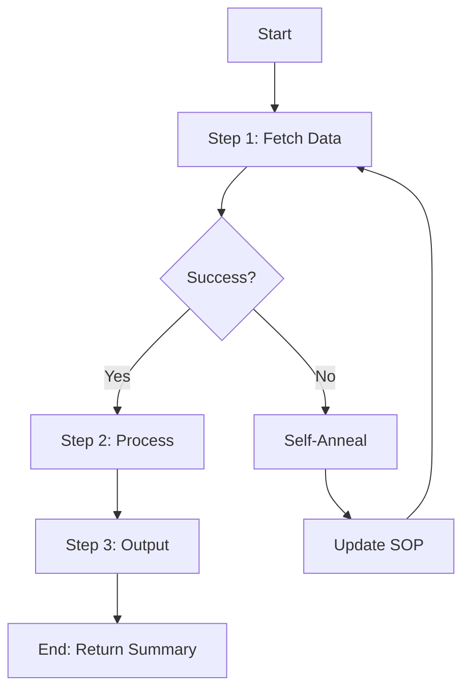

# MODULE TWO: AUTOMATION BUILDER
## The Code Generation Engine for Lean Automations

**Version:** 1.0.0  
**Module Type:** Builder (Code Generation)  
**Token Budget:** ~4,500 tokens (L1: 650 | L2: 1,200 | L3: 1,500 | L4: 1,150)  
**Receives From:** Module 1 (AUTOMATION_BLUEPRINT)  
**Outputs To:** Modules 4-8 (Execution Engines)  
**Build Date:** 2026-01-23  
**Doctrine:** Double-II | PCE Framework | Sandbox Filtering | Self-Annealing

---

# TABLE OF CONTENTS

1. [GEO Knowledge Compendium](#section-1-geo-knowledge-compendium) — The Five Builder Principles
2. [Module Blueprint](#section-2-module-blueprint) — The Five-Stage Generation Pipeline
3. [Knowledge Blocks](#section-3-knowledge-blocks) — Templates, Patterns, Heuristics
4. [Case Studies](#section-4-case-studies) — Real-World Generation Examples
5. [Pattern Library](#section-5-pattern-library) — Reusable Code Patterns
6. [Output Templates](#section-6-output-templates) — Ready-to-Use Scaffolds
7. [README & Integration](#section-7-readme-integration) — Quick Start Guide

---

# SECTION 1: GEO KNOWLEDGE COMPENDIUM
## The Five Builder Principles

*"Module 2 doesn't think about WHAT to build—that's Module 1's job. Module 2 thinks about HOW to build it correctly, following Double-II patterns and generating production-quality code."*

---

## 1.1 THE BUILDER'S ROLE

Module 2 is the **Code Factory**. It receives architectural decisions from Module 1 (AUTOMATION_BLUEPRINT) and transforms them into executable code packages. The output is always:

```
AUTOMATION_BLUEPRINT (from Module 1)
         │
         ▼
┌─────────────────────────────────────────┐
│       MODULE 2: AUTOMATION BUILDER      │
│         (Code Generation Engine)        │
├─────────────────────────────────────────┤
│                                         │
│  GENERATES:                             │
│  ├── SOP.md (human-readable workflow)   │
│  ├── coordinator.py (orchestration)     │
│  ├── scripts/*.py (execution layer)     │
│  ├── tests/*.py (validation)            │
│  ├── config.yaml (parameters)           │
│  ├── expertise.md (domain knowledge)    │
│  └── deploy.py (serverless config)      │
│                                         │
└─────────────────────────────────────────┘
         │
         ▼
    Ready-to-Execute Automation Package
```

---

## 1.2 THE FIVE BUILDER PRINCIPLES

### PRINCIPLE #1: Double-II Architecture

*Source: Kevin Badi*

**Definition:** Strict file separation enabling self-healing agents.

```
┌─────────────────────────────────────────────────────────────────────────────┐
│                         DOUBLE-II ARCHITECTURE                              │
├─────────────────────────────────────────────────────────────────────────────┤
│                                                                              │
│  INFORMATION LAYER — "The Brain" (.md files)                                │
│  ────────────────────────────────────────────                               │
│  Contains: SOPs, context, goals, learned constraints, expertise             │
│  Update Rule: Agent CAN modify freely during self-annealing                 │
│  Purpose: The agent reads this to understand WHY and WHAT                   │
│                                                                              │
│  IMPLEMENTATION LAYER — "The Body" (.py/.js files)                          │
│  ─────────────────────────────────────────────────                          │
│  Contains: Deterministic scripts, tool integrations, execution logic        │
│  Update Rule: Agent modifies cautiously, flags for human review             │
│  Purpose: The agent executes this for HOW                                   │
│                                                                              │
│  GENERATION RULE:                                                           │
│  Module 2 MUST produce both layers simultaneously.                          │
│  Every script gets a matching documentation file.                           │
│                                                                              │
└─────────────────────────────────────────────────────────────────────────────┘
```

**Self-Annealing Mechanism:**
1. Execution fails → Agent reads traceback
2. Agent updates Information with "Learned Constraint"
3. Agent fixes Implementation script
4. Agent retries execution
5. System gets smarter with every failure

---

### PRINCIPLE #2: PCE Framework (Plan-Coordinate-Execute)

*Source: Nick Puru*

**Definition:** Three-layer stack for reliable autonomous agents.

| Layer | Format | Role | Content |
|-------|--------|------|---------|
| **Planning** | Markdown SOP | The WHAT | Workflow steps a human could follow |
| **Coordination** | Python Manager | The BRAIN | Reads plan, sequences tasks, handles errors |
| **Execution** | Python Scripts | The TOOLS | "Dumb but reliable" single-action scripts |

**Key Insight:** Scripts are "dumb" because they're code—they cannot hallucinate. The LLM coordinates; scripts execute deterministically.

```python
# PCE in action
class Coordinator:  # COORDINATION LAYER
    def run(self):
        plan = self.load_sop()           # Read PLANNING LAYER
        leads = self.execute("fetch.py")  # Call EXECUTION LAYER
        verified = self.execute("verify.py", leads)
        return verified
```

---

### PRINCIPLE #3: Sandbox Filtering

*Source: Prompt Engineering, Arseny Shatokhin*

**Definition:** Scripts must return summaries, not raw data. This prevents "Intermediate Result Rot" (Module 1, Pain #6).

**The Rule:**
```python
# ❌ WRONG: Context dumping
return {"data": massive_50k_token_response}

# ✅ CORRECT: Sandbox filtering
return {
    "status": "success",
    "count": len(data),
    "sample": data[:3],
    "full_data_ref": "outputs/run_123.json"  # Reference, not data
}
```

**Evidence:**
| Operation | Without Sandbox | With Sandbox |
|-----------|-----------------|--------------|
| Transcript Analysis | 50,000 tokens | 500 tokens |
| API Response | 8,000 tokens | 200 tokens |
| Cost per Run | ~$0.75 | ~$0.01 |

---

### PRINCIPLE #4: Self-Annealing (Recursive Healing)

*Source: Kevin Badi, Nick Puru*

**Definition:** When scripts fail, the system learns and fixes itself.

```
┌─────────────────────────────────────────────────────────────────────────────┐
│                      SELF-ANNEALING LOOP                                    │
├─────────────────────────────────────────────────────────────────────────────┤
│                                                                              │
│  STEP 1: CAPTURE                                                            │
│  Coordinator catches stderr + traceback                                     │
│                   │                                                          │
│                   ▼                                                          │
│  STEP 2: ANALYZE                                                            │
│  Agent reads implementation code + error log                                │
│                   │                                                          │
│                   ▼                                                          │
│  STEP 3: DECIDE                                                             │
│  ├── Logic Error → Patch Implementation (flag for review)                   │
│  └── Constraint Error → Update SOP Dynamic Memory (auto-apply)              │
│                   │                                                          │
│                   ▼                                                          │
│  STEP 4: RETRY                                                              │
│  Re-run task immediately (max 3 attempts)                                   │
│                                                                              │
│  OUTCOME: Maintenance becomes training. System improves over time.          │
│                                                                              │
└─────────────────────────────────────────────────────────────────────────────┘
```

---

### PRINCIPLE #5: Context Quarantine

*Source: Dr. Maryam Miradi*

**Definition:** Heavy processing happens in isolated sub-processes to prevent context rot in the main coordinator.

**When to Use:**
- Analyzing 50+ documents
- Processing large datasets
- Running multiple parallel scrapes

**Mechanism:**
1. **Spawn:** Spin up temporary subprocess (fresh context)
2. **Execute:** Sub-process runs heavy tools
3. **Summarize:** Sub-process returns only the answer
4. **Kill:** Sub-process (and its bloated context) dies

```python
def quarantined_task(heavy_function, inputs):
    """Run in isolation, return only summary."""
    result = subprocess.run(
        ['python', 'isolated_task.py', json.dumps(inputs)],
        capture_output=True
    )
    # Only summary returns to main context
    return json.loads(result.stdout)
```

---

## 1.3 THE OUTPUT FOLDER STRUCTURE

Every generated package follows this structure:

```
automation_package/
│
├── information/                    # THE BRAIN (Double-II)
│   ├── SOP.md                      # Human-readable workflow + Dynamic Memory
│   ├── expertise.md                # Domain knowledge + patterns
│   ├── error_handling.md           # Known issues + resolutions
│   └── config.yaml                 # Configurable parameters
│
├── implementation/                 # THE BODY (Double-II)
│   ├── coordinator.py              # PCE Manager with Self-Annealing
│   ├── scripts/
│   │   ├── __init__.py
│   │   ├── step_1_fetch.py         # Sandbox-filtered script
│   │   ├── step_2_transform.py     # Sandbox-filtered script
│   │   ├── step_3_output.py        # Sandbox-filtered script
│   │   └── utils.py                # Shared utilities
│   ├── deploy.py                   # Serverless deployment config
│   └── requirements.txt            # Dependencies
│
├── planning/                       # VISUAL BRIDGE
│   └── workflow_visual.mmd         # Mermaid flowchart
│
├── tests/                          # VALIDATION
│   ├── test_step_1.py
│   ├── test_step_2.py
│   └── fixtures/
│       └── mock_data.json
│
├── outputs/                        # RUNTIME ARTIFACTS
│   └── .gitkeep
│
├── logs/                           # ANNEALING LOGS
│   └── .gitkeep
│
└── README.md                       # Quick start guide
```

---

# SECTION 2: MODULE BLUEPRINT
## The Five-Stage Generation Pipeline

*"Generated code is only as good as the templates it's built from. Module 2's templates encode production wisdom."*

---

## 2.1 PIPELINE OVERVIEW

```
┌─────────────────────────────────────────────────────────────────────────────┐
│                    MODULE 2 GENERATION PIPELINE                             │
├─────────────────────────────────────────────────────────────────────────────┤
│                                                                              │
│  STAGE 1: BLUEPRINT PARSING (10 min)                                        │
│  ──────────────────────────────────                                         │
│  • Validate AUTOMATION_BLUEPRINT schema                                     │
│  • Extract requirement summary                                              │
│  • Parse TOOL_DECISIONS for packages                                        │
│  • Identify complexity tier                                                 │
│                                                                              │
│  STAGE 2: INFORMATION LAYER GENERATION (20 min)                             │
│  ───────────────────────────────────────────────                            │
│  • Generate SOP.md with Dynamic Memory section                              │
│  • Generate expertise.md with domain patterns                               │
│  • Generate config.yaml with parameters                                     │
│                                                                              │
│  STAGE 3: IMPLEMENTATION LAYER GENERATION (30 min)                          │
│  ─────────────────────────────────────────────────                          │
│  • Generate coordinator.py with Self-Annealing                              │
│  • Generate scripts/*.py with Sandbox Filtering                             │
│  • Add package imports per TOOL_DECISIONS                                   │
│  • Generate deploy.py for serverless                                        │
│                                                                              │
│  STAGE 4: VALIDATION LAYER GENERATION (15 min)                              │
│  ───────────────────────────────────────────────                            │
│  • Generate test files for each script                                      │
│  • Create mock data fixtures                                                │
│                                                                              │
│  STAGE 5: VISUAL BRIDGE + ASSEMBLY (10 min)                                 │
│  ───────────────────────────────────────────                                │
│  • Generate Mermaid flowchart from coordinator                              │
│  • Generate requirements.txt                                                │
│  • Generate README.md                                                       │
│  • Organize into folder structure                                           │
│                                                                              │
│  TOTAL: ~85 minutes per automation package                                  │
│                                                                              │
└─────────────────────────────────────────────────────────────────────────────┘
```

---

## 2.2 STAGE 1: BLUEPRINT PARSING

**Objective:** Validate and understand the AUTOMATION_BLUEPRINT from Module 1.

### Step 1.1: Schema Validation

```python
def validate_blueprint(blueprint: dict) -> tuple[bool, list]:
    """Validate AUTOMATION_BLUEPRINT before generation."""
    errors = []
    
    # Required sections
    required = ['requirement', 'tool_decisions', 'pce_architecture']
    for section in required:
        if section not in blueprint:
            errors.append(f"Missing required section: {section}")
    
    # Validate tool decisions
    valid_levels = ['L1_CLI', 'L2_NPM_PACKAGE', 'L3_BROWSER', 'L4_INTERFACE', 'L5_MCP']
    for op, decision in blueprint.get('tool_decisions', {}).items():
        if decision.get('level') not in valid_levels:
            errors.append(f"Invalid tool level for {op}")
    
    return len(errors) == 0, errors
```

### Step 1.2: Complexity Classification

| Tier | Characteristics | Generation Strategy |
|------|-----------------|---------------------|
| **Tier 1** | Single script, linear flow | Minimal coordinator |
| **Tier 2** | 2-5 scripts, sequential + light parallel | Standard coordinator |
| **Tier 3** | 5+ scripts, heavy parallel, branching | Full coordinator with quarantine |

### Step 1.3: Package Identification

Extract from `tool_decisions`:
- NPM packages to install
- PIP packages to install
- Browser automation requirements
- Interface components needed

---

## 2.3 STAGE 2: INFORMATION LAYER GENERATION

**Objective:** Generate the "Brain" files that guide execution.

### Generated Files:

| File | Purpose | Template |
|------|---------|----------|
| `SOP.md` | Human-readable workflow with Dynamic Memory | See Section 6.1 |
| `expertise.md` | Domain knowledge, patterns, pitfalls | See Section 6.2 |
| `config.yaml` | Configurable parameters | See Section 6.3 |

### SOP Dynamic Memory

The SOP includes an auto-updated section for learned constraints:

```markdown
## 2. DYNAMIC MEMORY (AUTO-UPDATED)
*This section is updated automatically by the Coordinator during Self-Annealing.*
*DO NOT EDIT MANUALLY — Agent learns from failures here.*

| Date | Error Type | Constraint Added |
|------|------------|------------------|
| 2026-01-23 | RateLimitError | Wait 5s between LinkedIn requests |
| 2026-01-24 | SelectorError | Use XPath for login button on Site X |
```

---

## 2.4 STAGE 3: IMPLEMENTATION LAYER GENERATION

**Objective:** Generate the "Body" files that execute the workflow.

### Generated Files:

| File | Purpose | Template |
|------|---------|----------|
| `coordinator.py` | PCE Manager with Self-Annealing | See Section 6.4 |
| `scripts/step_N.py` | Sandbox-filtered execution scripts | See Section 6.5 |
| `deploy.py` | Serverless deployment config | See Section 6.6 |

### Coordinator Self-Annealing Hook

Every coordinator includes the self-healing loop:

```python
def run_with_annealing(self, script_path: str, inputs: dict) -> dict:
    attempt = 0
    while attempt < self.max_retries:
        try:
            result = subprocess.run(
                ['python', script_path, json.dumps(inputs)],
                capture_output=True, text=True, timeout=300
            )
            if result.returncode != 0:
                raise ExecutionError(result.stderr)
            return json.loads(result.stdout)
        except Exception as e:
            print(f"❌ Attempt {attempt + 1} failed. Engaging Auto-Fixer...")
            self._update_sop_constraints(script_path, str(e))
            self._log_fix_needed(script_path, str(e))
            attempt += 1
    raise MaxRetriesExceeded(script_path)
```

### Script Sandbox Pattern

Every script follows the sandbox filtering doctrine:

```python
def execute(inputs: dict) -> dict:
    # 1. HEAVY LIFT (in sandbox)
    raw_data = fetch_heavy_data(inputs)
    
    # 2. LOCAL PROCESSING
    processed = process_data(raw_data)
    
    # 3. EXTERNAL STORAGE
    ref_id = save_full_data(raw_data)
    
    # 4. COMPRESSED OUTPUT (only this reaches LLM)
    return {
        "status": "success",
        "count": len(processed),
        "sample": processed[:3],
        "full_data_ref": ref_id
    }
```

---

## 2.5 STAGE 4: VALIDATION LAYER GENERATION

**Objective:** Generate test files for quality assurance.

### Test Structure:

```python
# tests/test_step_1.py
import pytest
from scripts.step_1_fetch import execute

def test_execute_success():
    """Test successful execution."""
    result = execute({"source": "test"})
    assert result["status"] == "success"
    assert "count" in result
    assert "full_data_ref" in result

def test_sandbox_filtering():
    """Verify no raw data in output."""
    result = execute({"source": "test"})
    # Should have reference, not data
    assert "full_data_ref" in result
    assert "raw_data" not in result

def test_error_handling():
    """Test graceful error handling."""
    with pytest.raises(ValueError):
        execute({"source": "invalid"})
```

---

## 2.6 STAGE 5: VISUAL BRIDGE + ASSEMBLY

**Objective:** Generate visual documentation and package everything.

### Visual Bridge (Mermaid Generation)

*Source: Adam Goodyer*

Replace n8n's visual comfort with code-generated diagrams:

```python
def generate_flowchart(coordinator_path: str) -> str:
    """Generate Mermaid diagram from coordinator code."""
    code = Path(coordinator_path).read_text()
    
    prompt = f"""
    Convert this coordinator into a Mermaid TD flowchart.
    Show: step sequence, decision points, error handling, self-annealing.
    
    Code:
    {code}
    """
    
    diagram = llm.generate(prompt)
    
    output_path = Path("planning/workflow_visual.mmd")
    output_path.write_text(diagram)
    return str(output_path)
```

**Example Output:**


### README Generation

Every package includes quick start instructions:

```markdown
# [AUTOMATION_NAME]

## Quick Start
1. Install dependencies: `pip install -r requirements.txt`
2. Configure: Edit `information/config.yaml`
3. Run: `python implementation/coordinator.py`

## Structure
- `information/` — SOPs, expertise, config
- `implementation/` — Coordinator + scripts
- `planning/` — Visual flowchart
- `tests/` — Test suite

## Self-Healing
This automation learns from failures. Check `information/SOP.md`
Dynamic Memory section for learned constraints.
```

---

# SECTION 3: KNOWLEDGE BLOCKS
## Templates, Patterns, and Heuristics

*"Scripts are 'dumb but reliable.' The LLM coordinates; scripts execute deterministically."*

---

## 3.1 BUSINESS AUTOMATION PATTERNS

### Pattern: Lead Generation Pipeline

*Source: Kevin Badi, Nick Puru*

```yaml
leadgen_pipeline:
  name: "Apify + Enrichment Pipeline"
  
  stages:
    discovery:
      tool: "Google Maps Scraper (Apify)"
      rationale: "Cheaper and more reliable than generic search"
      output: "business_list"
      
    enrichment:
      tool: "Website Content Crawler"
      action: "Find contact pages, social links, emails"
      output: "enriched_leads"
      
    verification:
      tool: "MillionVerifier"
      rule: "NEVER trust scraped emails blindly"
      output: "verified_leads"
      
    filtering:
      mechanism: "Circuit breaker"
      rule: "If results > limit, abort and refine query"
      rationale: "Save Apify credits"
```

**Generated Coordinator Logic:**
```python
def leadgen_workflow(criteria: dict) -> dict:
    # 1. Discovery with circuit breaker
    raw_leads = self.run_with_annealing("scripts/discover.py", criteria)
    
    if raw_leads['count'] > criteria.get('max_results', 500):
        return {"status": "abort", "reason": "Too many results, refine query"}
    
    # 2. Enrichment
    enriched = self.run_with_annealing("scripts/enrich.py", raw_leads)
    
    # 3. Verification (CRITICAL)
    verified = self.run_with_annealing("scripts/verify.py", enriched)
    
    return {
        "status": "success",
        "count": verified['count'],
        "verified_ref": verified['full_data_ref']
    }
```

---

### Pattern: Outreach Campaign Injector

*Source: Kevin Badi, Nick Puru*

```yaml
outreach_pipeline:
  name: "Instantly Campaign Injector"
  
  stages:
    check_status:
      action: "Read campaign analytics first"
      metrics: ["sent", "open_rate", "reply_rate"]
      decision: "Only add batch if campaign needs leads"
      
    inject_leads:
      action: "Push enriched leads to campaign ID"
      api: "Instantly API"
      
    personalize:
      action: "Generate icebreaker locally"
      method: "Lightweight LLM call in script"
      rule: "Push personalization to Instantly, keep template generic"
```

**Generated Coordinator Logic:**
```python
def outreach_workflow(campaign_id: str, leads_ref: str) -> dict:
    # 1. Check campaign status
    stats = self.run_with_annealing("scripts/check_campaign.py", 
                                      {"campaign_id": campaign_id})
    
    if stats['pending'] > 100:
        return {"status": "skip", "reason": "Campaign has enough leads"}
    
    # 2. Load and personalize leads
    personalized = self.run_with_annealing("scripts/personalize.py",
                                            {"leads_ref": leads_ref})
    
    # 3. Inject to campaign
    result = self.run_with_annealing("scripts/inject_instantly.py",
                                      {"campaign_id": campaign_id,
                                       "leads": personalized})
    
    return {
        "status": "success",
        "injected": result['count'],
        "campaign_id": campaign_id
    }
```

---

### Pattern: Content Repurposing Pipeline

*Source: Kevin Badi*

```yaml
content_pipeline:
  name: "Viral Post Generator"
  
  stages:
    extract:
      input: "YouTube URL"
      action: "Download transcript"
      
    process:
      action: "Summarize, extract Hook and Value points"
      
    format:
      framework: "Viral Scripting Framework"
      structure:
        hook: "Attention grabber"
        retain: "Why keep reading"
        reward: "The value delivery"
        cta: "What to do next"
      location: "Defined in expertise.md"
      
    output:
      destination: "Supabase/Airtable"
      rule: "NEVER auto-post immediately"
      rationale: "Human review before publishing"
```

**Generated Coordinator Logic:**
```python
def content_workflow(video_url: str) -> dict:
    # 1. Extract transcript (Sandbox - don't return full text)
    transcript = self.run_with_annealing("scripts/extract_transcript.py",
                                          {"url": video_url})
    
    # 2. Process with framework
    processed = self.run_with_annealing("scripts/process_content.py",
                                         {"transcript_ref": transcript['ref']})
    
    # 3. Format posts
    posts = self.run_with_annealing("scripts/format_posts.py",
                                     {"content": processed})
    
    # 4. Save for review (NOT auto-post)
    saved = self.run_with_annealing("scripts/save_for_review.py",
                                     {"posts": posts})
    
    return {
        "status": "pending_review",
        "post_count": saved['count'],
        "review_ref": saved['full_data_ref']
    }
```

---

## 3.2 GENERATION HEURISTICS

### Heuristic #1: Double-II Mandatory
```yaml
H1_DOUBLE_II:
  condition: "Generating any automation package"
  action: "MUST produce Information + Implementation layers together"
  avoid: "Scripts without matching documentation"
  rationale: "Enables self-healing"
```

### Heuristic #2: Sandbox Filtering Default
```yaml
H2_SANDBOX_FILTERING:
  condition: "Script returns data to coordinator"
  action: "Return summary + reference, NEVER raw data"
  avoid: "Dumping full JSON/HTML to stdout"
  rationale: "Prevents context rot"
```

### Heuristic #3: Self-Annealing Hooks
```yaml
H3_SELF_ANNEALING:
  condition: "Generating coordinator.py"
  action: "Include try/catch/fix/retry loop with SOP update"
  avoid: "Simple linear execution without error recovery"
  rationale: "Turns maintenance into training"
```

### Heuristic #4: Circuit Breaker on Discovery
```yaml
H4_CIRCUIT_BREAKER:
  condition: "Scraping or API discovery operations"
  action: "Add result count check before proceeding"
  threshold: "Configurable, default 500"
  rationale: "Saves API credits, prevents runaway costs"
```

### Heuristic #5: Verification Before Action
```yaml
H5_VERIFY_FIRST:
  condition: "Lead gen or data collection"
  action: "Always verify emails/data before outreach"
  avoid: "Trusting scraped data blindly"
  rationale: "Protects deliverability, prevents wasted effort"
```

### Heuristic #6: No Auto-Publish
```yaml
H6_NO_AUTO_PUBLISH:
  condition: "Content generation workflow"
  action: "Save to review queue, not direct publish"
  avoid: "Auto-posting without human review"
  rationale: "Quality control, brand safety"
```

### Heuristic #7: Context Quarantine for Heavy Tasks
```yaml
H7_QUARANTINE:
  condition: "Processing >10 documents or >50k tokens"
  action: "Spawn sub-process, return only summary"
  avoid: "Loading heavy data into main coordinator context"
  rationale: "Prevents context rot in long-running workflows"
```

### Heuristic #8: Visual Bridge Default
```yaml
H8_VISUAL_BRIDGE:
  condition: "Completing any automation package"
  action: "Generate Mermaid flowchart from coordinator"
  output: "planning/workflow_visual.mmd"
  rationale: "Replaces n8n visual comfort"
```

---

## 3.3 ERROR TAXONOMY

Generated code should handle these error categories:

| Error Type | Recoverable | Self-Anneal Action | Example |
|------------|-------------|-------------------|---------|
| `RateLimitError` | Yes | Wait + retry | API 429 response |
| `AuthenticationError` | Yes | Refresh credentials | Token expired |
| `SelectorError` | Yes | Update SOP constraint | DOM changed |
| `ValidationError` | No | Flag for review | Bad input schema |
| `QuotaExhaustedError` | No | Wait for reset | Daily limit hit |
| `PlatformChangeError` | No | Flag for review | Site redesign |
| `TimeoutError` | Yes | Extend timeout + retry | Slow response |
| `NetworkError` | Yes | Retry with backoff | Connection failed |

---

# SECTION 4: CASE STUDIES
## Real-World Generation Examples

---

## 4.1 Case Study: LinkedIn Lead Discovery

**Blueprint Input (from Module 1):**
```yaml
requirement:
  name: "LinkedIn Lead Discovery"
  description: "Find coaching prospects with 10K-50K followers"
  trigger: "Manual (weekly)"

tool_decisions:
  linkedin_scraping:
    level: L3_BROWSER
    tool: Playwright
  data_storage:
    level: L1_CLI
    tool: JSON file

pce_architecture:
  execution:
    scripts:
      - search_profiles.py
      - scrape_profiles.py
      - filter_qualify.py
```

**Generated Package:**
```
linkedin_lead_discovery/
├── information/
│   ├── SOP.md                    # With Dynamic Memory
│   ├── expertise.md              # LinkedIn scraping patterns
│   └── config.yaml               # Search criteria
├── implementation/
│   ├── coordinator.py            # Self-Annealing enabled
│   ├── scripts/
│   │   ├── search_profiles.py    # Sandbox-filtered
│   │   ├── scrape_profiles.py    # Sandbox-filtered
│   │   └── filter_qualify.py     # Sandbox-filtered
│   ├── deploy.py                 # Modal cron config
│   └── requirements.txt
├── planning/
│   └── workflow_visual.mmd       # Mermaid diagram
├── tests/
│   └── ...
└── README.md
```

**Generated expertise.md:**
```markdown
# LinkedIn Scraping Expertise

## Rate Limits (Learned)
- Profile views: 80-100/day (spread across hours)
- Search results: 1000/month on free
- Delay between actions: 30-90 seconds (random)

## Detection Avoidance
- Rotate user agents every session
- Use residential proxies for scale
- Mimic human scroll patterns

## Selector Patterns
- Profile name: `.text-heading-xlarge`
- Headline: `.text-body-medium`
- About: `#about ~ .display-flex`

## Pitfalls
- Sales Navigator has different selectors
- Login walls after 10 profiles (need cookies)
- Phantom profiles (redirects to 404)
```

---

## 4.2 Case Study: Multi-Platform Content Repurposing

**Blueprint Input:**
```yaml
requirement:
  name: "Video to Multi-Format Content"
  description: "Convert YouTube video to blog + social posts"
  trigger: "Webhook (new video upload)"

tool_decisions:
  transcript:
    level: L2_NPM_PACKAGE
    tool: youtube-transcript-api
  content_gen:
    level: INTERNAL_LLM
  storage:
    level: L2_NPM_PACKAGE
    tool: supabase-py

pce_architecture:
  execution:
    scripts:
      - extract_transcript.py
      - generate_blog.py
      - generate_social.py
      - save_for_review.py
```

**Generated Coordinator (excerpt):**
```python
def execute_workflow(self, video_url: str) -> dict:
    """
    Content Repurposing Workflow
    
    PCE Framework:
    - Planning: Loaded from SOP.md + viral_framework expertise
    - Coordination: This method
    - Execution: Sandbox-filtered scripts
    """
    
    # Step 1: Extract (Quarantine - heavy data)
    transcript = self.run_with_annealing(
        "scripts/extract_transcript.py",
        {"url": video_url}
    )
    # Sandbox: Returns word_count + ref, not full text
    
    # Step 2: Generate Blog
    blog = self.run_with_annealing(
        "scripts/generate_blog.py",
        {"transcript_ref": transcript['full_data_ref']}
    )
    
    # Step 3: Generate Social
    social = self.run_with_annealing(
        "scripts/generate_social.py",
        {"blog_ref": blog['full_data_ref']}
    )
    
    # Step 4: Save for Review (NO AUTO-POST)
    saved = self.run_with_annealing(
        "scripts/save_for_review.py",
        {"blog": blog, "social": social}
    )
    
    return {
        "status": "pending_review",
        "video_url": video_url,
        "posts_generated": 4,  # blog + 3 social
        "review_ref": saved['full_data_ref']
    }
```

---

# SECTION 5: PATTERN LIBRARY
## Reusable Code Patterns

---

## 5.1 Coordinator Patterns

### Pattern: Basic Sequential
```python
def execute_workflow(self, inputs: dict) -> dict:
    step_1 = self.run_with_annealing("scripts/step_1.py", inputs)
    step_2 = self.run_with_annealing("scripts/step_2.py", step_1)
    step_3 = self.run_with_annealing("scripts/step_3.py", step_2)
    return step_3
```

### Pattern: Parallel with Aggregation
```python
async def execute_workflow(self, inputs: dict) -> dict:
    # Parallel execution
    tasks = [
        self.run_async("scripts/scrape_linkedin.py", inputs),
        self.run_async("scripts/scrape_instagram.py", inputs),
        self.run_async("scripts/scrape_youtube.py", inputs),
    ]
    results = await asyncio.gather(*tasks)
    
    # Aggregation
    merged = self.run_with_annealing(
        "scripts/merge_dedupe.py",
        {"sources": results}
    )
    return merged
```

### Pattern: Conditional Branching
```python
def execute_workflow(self, inputs: dict) -> dict:
    initial = self.run_with_annealing("scripts/fetch.py", inputs)
    
    # Branch based on result
    if initial['count'] > 100:
        # High volume path
        processed = self.run_with_annealing(
            "scripts/batch_process.py",
            initial
        )
    else:
        # Low volume path
        processed = self.run_with_annealing(
            "scripts/simple_process.py",
            initial
        )
    
    return processed
```

---

## 5.2 Script Patterns

### Pattern: API Fetch with Sandbox
```python
def execute(inputs: dict) -> dict:
    # Fetch from API
    response = requests.get(
        f"https://api.example.com/{inputs['endpoint']}",
        headers={"Authorization": f"Bearer {os.environ['API_KEY']}"}
    )
    data = response.json()
    
    # SANDBOX: Process and compress
    processed = [item['id'] for item in data['results']]
    ref_id = save_to_file(data)
    
    return {
        "status": "success",
        "count": len(processed),
        "ids": processed[:10],  # Sample only
        "full_data_ref": ref_id
    }
```

### Pattern: Browser Scrape with Sandbox
```python
async def execute(inputs: dict) -> dict:
    async with async_playwright() as p:
        browser = await p.chromium.launch(headless=True)
        page = await browser.new_page()
        
        await page.goto(inputs['url'])
        
        # Extract only needed data
        data = await page.evaluate('''() => ({
            title: document.querySelector('h1')?.textContent,
            links: [...document.querySelectorAll('a')]
                   .map(a => a.href)
                   .slice(0, 20)
        })''')
        
        await browser.close()
    
    # SANDBOX: Return summary
    return {
        "status": "success",
        "title": data['title'],
        "link_count": len(data['links']),
        "sample_links": data['links'][:5]
    }
```

### Pattern: LLM Processing with Sandbox
```python
def execute(inputs: dict) -> dict:
    # Load full data from reference
    full_text = load_from_ref(inputs['text_ref'])
    
    # Process with LLM (in sandbox)
    summary = llm.generate(
        f"Summarize this in 3 bullet points: {full_text[:10000]}"
    )
    
    key_points = llm.generate(
        f"Extract 5 key insights: {full_text[:10000]}"
    )
    
    # Save full analysis externally
    full_analysis = {"summary": summary, "key_points": key_points}
    ref_id = save_to_file(full_analysis)
    
    # SANDBOX: Return compressed
    return {
        "status": "success",
        "summary_preview": summary[:200],
        "key_point_count": len(key_points.split('\n')),
        "full_analysis_ref": ref_id
    }
```

---

# SECTION 6: OUTPUT TEMPLATES
## Ready-to-Use Scaffolds

---

## 6.1 SOP.md Template

```markdown
# [AUTOMATION_NAME] — Standard Operating Procedure

## 1. GOAL & CONTEXT
**Objective:** [One-sentence description from blueprint.requirement.description]
**Trigger:** [blueprint.requirement.trigger]
**Success Criteria:** [blueprint.requirement.success_criteria]
**Owner:** [Team/individual responsible]

---

## 2. DYNAMIC MEMORY (AUTO-UPDATED)
*This section is updated automatically by the Coordinator during Self-Annealing.*
*DO NOT EDIT MANUALLY — Agent learns from failures here.*

| Date | Error Type | Constraint Added |
|------|------------|------------------|

---

## 3. PREREQUISITES
- [ ] Environment variable `X` configured
- [ ] Package dependencies installed (`pip install -r requirements.txt`)
- [ ] API access verified for [services]

---

## 4. EXECUTION STEPS

### Step 1: [Step Name from blueprint]
**Script:** `scripts/step_1.py`
**Input:** [Description]
**Output:** [Description]
**Sandbox Rule:** Return [summary type], not raw data

### Step 2: [Step Name]
**Script:** `scripts/step_2.py`
...

---

## 5. EDGE CASE PROTOCOLS
- **IF** result count > [threshold] **THEN** abort and refine query
- **IF** rate limited **THEN** wait [duration] and retry
- **IF** authentication fails **THEN** refresh credentials

---

## 6. ROLLBACK PROCEDURE
If workflow fails after Step X:
1. Check `logs/annealing_log.json` for error details
2. Review Dynamic Memory for learned constraints
3. Manual intervention: [specific steps]
```

---

## 6.2 coordinator.py Template

```python
"""
[AUTOMATION_NAME] Coordinator
Generated by MODULE 2: Automation Builder

Implements:
- PCE Framework (Plan-Coordinate-Execute)
- Double-II Architecture (Info + Impl separation)
- Self-Annealing Loop (try/catch/fix/retry)
- Sandbox Filtering (compressed outputs only)
"""

import subprocess
import json
import os
import sys
from datetime import datetime
from pathlib import Path
from typing import Dict, Any, Optional


class AutomationCoordinator:
    """
    The "Manager" layer in PCE Framework.
    
    Responsibilities:
    - Read Planning layer (SOP.md)
    - Sequence Execution layer calls
    - Handle errors with Self-Annealing
    - Maintain lean context (Sandbox Filtering)
    """
    
    def __init__(self, config_path: str = "information/config.yaml"):
        self.config = self._load_config(config_path)
        self.sop_path = "information/SOP.md"
        self.run_id = f"run_{datetime.now().strftime('%Y%m%d_%H%M%S')}"
        self.max_retries = self.config.get('max_retries', 3)
        
        print(f"🚀 Initializing: {self.run_id}")
    
    def _load_config(self, path: str) -> dict:
        """Load configuration from YAML."""
        import yaml
        config_file = Path(path)
        if config_file.exists():
            return yaml.safe_load(config_file.read_text())
        return {}
    
    def run_with_annealing(
        self,
        script_path: str,
        inputs: dict,
        timeout: int = 300
    ) -> dict:
        """
        Execute script with Self-Annealing loop.
        
        PCE Execution Layer: Scripts are "dumb but reliable."
        If failure: update SOP, log fix needed, retry.
        """
        attempt = 0
        
        while attempt < self.max_retries:
            try:
                print(f"  → Running {script_path} (attempt {attempt + 1})")
                
                # Execute script as subprocess
                result = subprocess.run(
                    ['python', script_path, json.dumps(inputs)],
                    capture_output=True,
                    text=True,
                    timeout=timeout
                )
                
                # Check for failure
                if result.returncode != 0:
                    raise ExecutionError(f"{script_path}: {result.stderr}")
                
                # Parse sandbox-filtered output
                output = json.loads(result.stdout)
                print(f"  ✓ {script_path} complete: {output.get('status', 'ok')}")
                return output
                
            except json.JSONDecodeError as e:
                raise ExecutionError(f"Invalid JSON output from {script_path}")
                
            except Exception as e:
                print(f"  ❌ Attempt {attempt + 1} failed: {str(e)[:100]}")
                
                # Self-Annealing
                self._update_sop_constraints(script_path, str(e))
                self._log_fix_needed(script_path, str(e))
                
                attempt += 1
        
        raise MaxRetriesExceeded(
            f"{script_path} failed after {self.max_retries} attempts"
        )
    
    def _update_sop_constraints(self, script_name: str, error: str):
        """
        Update SOP Dynamic Memory with learned constraint.
        This is the Information Layer update in Double-II.
        """
        timestamp = datetime.now().strftime('%Y-%m-%d')
        error_type = error.split(':')[0] if ':' in error else 'UnknownError'
        constraint = error[:100].replace('|', '-')
        
        entry = f"| {timestamp} | {error_type} | {constraint} |\n"
        
        try:
            with open(self.sop_path, 'a') as f:
                f.write(entry)
            print(f"  📝 Updated SOP Dynamic Memory")
        except Exception as e:
            print(f"  ⚠️ Could not update SOP: {e}")
    
    def _log_fix_needed(self, script_path: str, error: str):
        """Log that Implementation may need review."""
        log_entry = {
            "timestamp": datetime.now().isoformat(),
            "run_id": self.run_id,
            "script": script_path,
            "error": error[:500],
            "status": "needs_review"
        }
        
        log_path = Path("logs/annealing_log.json")
        log_path.parent.mkdir(exist_ok=True)
        
        existing = []
        if log_path.exists():
            try:
                existing = json.loads(log_path.read_text())
            except:
                pass
        
        existing.append(log_entry)
        log_path.write_text(json.dumps(existing, indent=2))
    
    def execute_workflow(self, inputs: dict) -> dict:
        """
        Main workflow execution.
        
        Override this method with specific workflow logic.
        """
        raise NotImplementedError("Subclass must implement execute_workflow")
    
    def run(self, inputs: Optional[dict] = None) -> dict:
        """Entry point for workflow execution."""
        inputs = inputs or {}
        
        try:
            result = self.execute_workflow(inputs)
            result['run_id'] = self.run_id
            result['completed_at'] = datetime.now().isoformat()
            
            # Save full results externally
            output_path = Path(f"outputs/{self.run_id}.json")
            output_path.parent.mkdir(exist_ok=True)
            output_path.write_text(json.dumps(result, indent=2))
            
            print(f"\n✅ Workflow complete: {self.run_id}")
            return result
            
        except Exception as e:
            print(f"\n❌ Workflow failed: {e}")
            return {
                "run_id": self.run_id,
                "status": "failed",
                "error": str(e)
            }


class ExecutionError(Exception):
    """Script execution failed."""
    pass


class MaxRetriesExceeded(Exception):
    """Self-healing exhausted all retries."""
    pass


# ═══════════════════════════════════════════════════════════════════════════
# WORKFLOW IMPLEMENTATION
# Generated based on AUTOMATION_BLUEPRINT
# ═══════════════════════════════════════════════════════════════════════════

class [AUTOMATION_NAME]Coordinator(AutomationCoordinator):
    """
    [AUTOMATION_NAME] Workflow
    
    Blueprint: [blueprint_id]
    Generated: [timestamp]
    """
    
    def execute_workflow(self, inputs: dict) -> dict:
        """
        [WORKFLOW_DESCRIPTION]
        """
        
        # Step 1: [STEP_1_NAME]
        result_1 = self.run_with_annealing(
            "implementation/scripts/step_1.py",
            inputs
        )
        
        # Step 2: [STEP_2_NAME]
        result_2 = self.run_with_annealing(
            "implementation/scripts/step_2.py",
            result_1
        )
        
        # Step 3: [STEP_3_NAME]
        result_3 = self.run_with_annealing(
            "implementation/scripts/step_3.py",
            result_2
        )
        
        # Sandbox-filtered final result
        return {
            "status": "success",
            "summary": f"Processed {result_3.get('count', 'N/A')} items",
            "final_ref": result_3.get('full_data_ref')
        }


# ═══════════════════════════════════════════════════════════════════════════
# CLI ENTRY POINT
# ═══════════════════════════════════════════════════════════════════════════

if __name__ == "__main__":
    # Parse input
    if len(sys.argv) > 1:
        inputs = json.loads(sys.argv[1])
    else:
        inputs = {}
    
    # Run workflow
    coordinator = [AUTOMATION_NAME]Coordinator()
    result = coordinator.run(inputs)
    
    # Output result
    print(json.dumps(result, indent=2))
```

---

## 6.3 Script Template (step_N.py)

```python
"""
[STEP_NAME] Script
Part of: [AUTOMATION_NAME]

Generated by MODULE 2: Automation Builder
Implements: Sandbox Filtering (prevents Context Rot)

DOCTRINE:
- Process heavy data HERE (in sandbox)
- Return only summaries/references
- Store full data externally
"""

import json
import sys
import os
from datetime import datetime
from pathlib import Path
from typing import Dict, Any, List


# ═══════════════════════════════════════════════════════════════════════════
# CONFIGURATION
# ═══════════════════════════════════════════════════════════════════════════

OUTPUT_DIR = Path("outputs")
OUTPUT_DIR.mkdir(exist_ok=True)


# ═══════════════════════════════════════════════════════════════════════════
# EXPERTISE LOADER
# ═══════════════════════════════════════════════════════════════════════════

def load_expertise() -> str:
    """Load domain expertise if available."""
    expertise_path = Path("information/expertise.md")
    if expertise_path.exists():
        return expertise_path.read_text()
    return ""


# ═══════════════════════════════════════════════════════════════════════════
# MAIN EXECUTION
# ═══════════════════════════════════════════════════════════════════════════

def execute(inputs: Dict[str, Any]) -> Dict[str, Any]:
    """
    Execute [STEP_NAME].
    
    Args:
        inputs: [Description of expected inputs]
    
    Returns:
        Sandbox-filtered result with:
        - status: success/failure
        - count: number of items processed
        - sample: first few items (preview)
        - full_data_ref: path to full data file
    
    SANDBOX RULES:
    1. Fetch/process heavy data internally
    2. NEVER return raw data to stdout
    3. Return summary + reference ID only
    """
    
    # ─────────────────────────────────────────────────────────────────────
    # 1. HEAVY LIFT (happens in sandbox)
    # ─────────────────────────────────────────────────────────────────────
    
    raw_data = _fetch_data(inputs)
    
    # ─────────────────────────────────────────────────────────────────────
    # 2. LOCAL PROCESSING
    # ─────────────────────────────────────────────────────────────────────
    
    processed = _process_data(raw_data)
    
    # ─────────────────────────────────────────────────────────────────────
    # 3. EXTERNAL STORAGE (full data saved, not returned)
    # ─────────────────────────────────────────────────────────────────────
    
    ref_id = _save_full_data(processed)
    
    # ─────────────────────────────────────────────────────────────────────
    # 4. COMPRESSED OUTPUT (only this reaches coordinator context)
    # ─────────────────────────────────────────────────────────────────────
    
    return {
        "status": "success",
        "count": len(processed) if isinstance(processed, list) else 1,
        "sample": processed[:3] if isinstance(processed, list) else processed,
        "processed_at": datetime.now().isoformat(),
        "full_data_ref": ref_id
    }


# ═══════════════════════════════════════════════════════════════════════════
# IMPLEMENTATION (Override for specific use case)
# ═══════════════════════════════════════════════════════════════════════════

def _fetch_data(inputs: Dict[str, Any]) -> Any:
    """
    Fetch raw data.
    
    TODO: Implement based on TOOL_DECISION from blueprint.
    """
    # [GENERATED BASED ON tool_decisions.level]
    raise NotImplementedError("Implement _fetch_data")


def _process_data(raw_data: Any) -> Any:
    """
    Process/transform raw data.
    
    TODO: Implement based on workflow requirements.
    """
    # [GENERATED BASED ON pce_architecture.execution.scripts]
    return raw_data


def _save_full_data(data: Any) -> str:
    """Save full data externally, return reference path."""
    ref_id = f"step_N_{datetime.now().strftime('%Y%m%d_%H%M%S')}"
    output_path = OUTPUT_DIR / f"{ref_id}.json"
    
    output_path.write_text(json.dumps(data, default=str, indent=2))
    
    return str(output_path)


# ═══════════════════════════════════════════════════════════════════════════
# CLI INTERFACE
# ═══════════════════════════════════════════════════════════════════════════

if __name__ == "__main__":
    # Input from command line (passed by Coordinator)
    if len(sys.argv) > 1:
        inputs = json.loads(sys.argv[1])
    else:
        # Read from stdin as fallback
        inputs = json.loads(sys.stdin.read())
    
    # Execute
    result = execute(inputs)
    
    # STDOUT = Sandbox-filtered output only
    print(json.dumps(result))
```

---

## 6.4 deploy.py Template

```python
"""
[AUTOMATION_NAME] Deployment Script
Generated by MODULE 2: Automation Builder

Deploys to: Modal (serverless)
Modes: Cron (scheduled) or Webhook (on-demand)
"""

import modal
from pathlib import Path

# Create Modal stub
stub = modal.Stub("[automation_name]")

# Mount local files
local_files = modal.Mount.from_local_dir(
    Path(__file__).parent,
    remote_path="/app"
)


@stub.function(
    schedule=modal.Cron("[CRON_EXPRESSION]"),  # e.g., "0 9 * * *" for 9 AM daily
    mounts=[local_files],
    timeout=3600  # 1 hour max
)
def run_scheduled():
    """Run automation on schedule."""
    import sys
    sys.path.insert(0, "/app")
    
    from implementation.coordinator import [AUTOMATION_NAME]Coordinator
    
    coordinator = [AUTOMATION_NAME]Coordinator()
    result = coordinator.run({"trigger": "scheduled"})
    
    return result


@stub.webhook()
def run_on_demand(payload: dict):
    """Run automation on webhook trigger."""
    import sys
    sys.path.insert(0, "/app")
    
    from implementation.coordinator import [AUTOMATION_NAME]Coordinator
    
    coordinator = [AUTOMATION_NAME]Coordinator()
    result = coordinator.run(payload)
    
    return result


if __name__ == "__main__":
    # Deploy with: modal deploy deploy.py
    print("Deploy with: modal deploy deploy.py")
    print("Or run locally: modal run deploy.py::run_scheduled")
```

---

# SECTION 7: README & INTEGRATION
## Quick Start Guide

---

## 7.1 WHAT THIS MODULE DOES

**Module 2: Automation Builder** transforms AUTOMATION_BLUEPRINT (from Module 1) into executable code packages. It generates:

| Output | Purpose |
|--------|---------|
| `SOP.md` | Human-readable workflow with Dynamic Memory |
| `coordinator.py` | PCE Manager with Self-Annealing |
| `scripts/*.py` | Sandbox-filtered execution scripts |
| `tests/*.py` | Validation test suite |
| `deploy.py` | Serverless deployment config |
| `workflow_visual.mmd` | Mermaid flowchart |

## 7.2 INTEGRATION MAP

```
┌─────────────────────────────────────────────────────────────────────────────┐
│                           MODULE FLOW                                       │
├─────────────────────────────────────────────────────────────────────────────┤
│                                                                              │
│  MODULE 1                      MODULE 2                     MODULES 4-8     │
│  ──────────                    ──────────                   ─────────────   │
│                                                                              │
│  AUTOMATION    ────────►    Code Generation    ────────►    Execution       │
│  BLUEPRINT                      Engine                       Engines        │
│                                                                              │
│  Defines:                    Produces:                      Uses:           │
│  • Requirements              • SOP.md                       • Browser       │
│  • Tool decisions            • coordinator.py               • Content       │
│  • PCE architecture          • scripts/*.py                 • Outreach      │
│                              • tests/*.py                   • Interface     │
│                              • deploy.py                    • Onboarding    │
│                                                                              │
└─────────────────────────────────────────────────────────────────────────────┘
```

## 7.3 DOCTRINE COMPLIANCE CHECKLIST

Every generated package must pass:

| Check | Requirement |
|-------|-------------|
| ✅ Double-II | Information + Implementation layers present |
| ✅ PCE | Plan (SOP) + Coordinate + Execute structure |
| ✅ Sandbox | Scripts return summaries, not raw data |
| ✅ Self-Annealing | Coordinator has try/catch/fix/retry loop |
| ✅ Dynamic Memory | SOP has auto-update section |
| ✅ Visual Bridge | Mermaid diagram generated |
| ✅ Deployment Ready | deploy.py included |

## 7.4 TOKEN BUDGET

| Layer | Content | Tokens |
|-------|---------|--------|
| L1 | Quick reference + principles | 650 |
| L2 | Pipeline stages + patterns | 1,200 |
| L3 | Templates + heuristics | 1,500 |
| L4 | Case studies + integration | 1,150 |
| **Total** | | **4,500** |

## 7.5 VERSION HISTORY

| Version | Date | Changes |
|---------|------|---------|
| 1.0.0 | 2026-01-23 | Initial release with NotebookLM patches: Double-II, PCE, Sandbox Filtering, Self-Annealing, Visual Bridge, Deployment |

---

**END OF MODULE TWO: AUTOMATION BUILDER v1.0.0**

---

*"Scripts are 'dumb but reliable.' The LLM coordinates; scripts execute deterministically."*

*ULTRAMIND Automation Factory — Module TWO v1.0.0 Complete*
